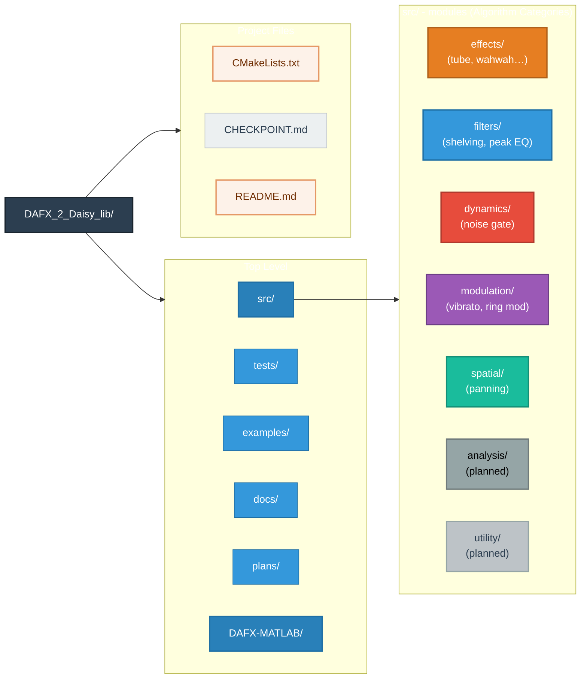

# DAFX-to-DaisySP Library

[](https://github.com/electro-smith/DAFX_2_Daisy_lib/actions/workflows/build.yml)
[](LICENSE)
[](https://isocpp.org/)
[](https://cmake.org/)

A **portable DSP algorithm library** derived from the DAFX (Digital Audio Effects, 2nd Edition) textbook by Udo Zölzer, targeting the Daisy Seed embedded platform while maintaining **complete hardware independence**.

## Overview

This library bridges the gap between academic DSP algorithms documented in the DAFX textbook and practical embedded audio implementations. It enables developers to deploy professional-grade audio effects on Daisy Seed hardware without being constrained to specific hardware configurations.

### Key Features

- **Academic Rigor** — Algorithms derived from peer-reviewed DSP textbook with mathematical foundations
- **Hardware Independence** — Pure C++ DSP modules work across Daisy Pod, Field, Patch, Petal, or custom designs
- **DaisySP Compatibility** — Follows established DaisySP API patterns for seamless integration
- **Real-time Performance** — Optimized for ARM Cortex-M7 constraints at 96kHz/24-bit audio
- **Comprehensive Testing** — Unit tests with Google Test framework

## Implemented Effects

### Effects (Virtual Analog)
| Effect | File | Description |
|--------|------|-------------|
| Tube Distortion | [`tube.cpp`](src/effects/tube.cpp) | Valve/tube saturation simulation |
| Wah-Wah | [`wahwah.cpp`](src/effects/wahwah.cpp) | CryBaby-style wah pedal |
| Tone Stack | [`tonestack.cpp`](src/effects/tonestack.cpp) | Amplifier tone controls |

### Filters
| Filter | File | Description |
|--------|------|-------------|
| Low Shelving | [`lowshelving.cpp`](src/filters/lowshelving.cpp) | Bass boost/cut filter |
| High Shelving | [`highshelving.cpp`](src/filters/highshelving.cpp) | Treble boost/cut filter |
| Peak Filter | [`peakfilter.cpp`](src/filters/peakfilter.cpp) | Parametric EQ band |

### Dynamics
| Processor | File | Description |
|-----------|------|-------------|
| Noise Gate | [`noisegate.cpp`](src/dynamics/noisegate.cpp) | Signal noise reduction |

### Modulation
| Effect | File | Description |
|--------|------|-------------|
| Vibrato | [`vibrato.cpp`](src/modulation/vibrato.cpp) | Pitch modulation effect |
| Ring Modulator | [`ringmod.cpp`](src/modulation/ringmod.cpp) | Ring modulation synthesis |

### Spatial
| Effect | File | Description |
|--------|------|-------------|
| Stereo Pan | [`stereopan.cpp`](src/spatial/stereopan.cpp) | Stereo panning with multiple laws |

## Building

### Requirements

- CMake 3.16+
- C++17 compatible compiler (GCC, Clang, or MSVC)
- Optional: ARM GCC Toolchain for embedded deployment

### Quick Start

```bash
# Clone the repository
git clone https://github.com/your-username/DAFX_2_Daisy_lib.git
cd DAFX_2_Daisy_lib

# Build the library
mkdir build && cd build
cmake ..
cmake --build .

# Run tests (optional)
ctest --output-on-failure
```

### Build Options

| Option | Default | Description |
|--------|---------|-------------|
| `BUILD_TESTING` | ON | Build unit tests |
| `BUILD_EXAMPLES` | ON | Build example programs |

```bash
# Build without tests
cmake -DBUILD_TESTING=OFF ..
```

## Usage

### Basic Example

```cpp
#include "effects/tube.h"
#include "filters/lowshelving.h"

using namespace daisysp;

// Create effect instances
Tube tube;
LowShelving bass;

void InitEffects(float sample_rate)
{
    // Initialize with sample rate
    tube.Init(sample_rate);
    tube.SetDrive(0.7f);     // 70% drive
    tube.SetBias(0.2f);      // Slight asymmetry
    
    bass.Init(sample_rate);
    bass.SetFrequency(200.0f);  // 200 Hz corner frequency
    bass.SetGain(6.0f);         // +6 dB boost
}

float ProcessSample(float in)
{
    // Chain effects
    float out = tube.Process(in);
    out = bass.Process(out);
    return out;
}
```

### Daisy Hardware Integration

The library is hardware-agnostic — integrate with any Daisy hardware variant:

```cpp
#include "daisy_pod.h"
#include "effects/tube.h"

daisy::DaisyPod pod;
daisysp::Tube tube;

void AudioCallback(daisy::AudioHandle::InputBuffer in,
                   daisy::AudioHandle::OutputBuffer out,
                   size_t size)
{
    for (size_t i = 0; i < size; i++)
    {
        out[0][i] = tube.Process(in[0][i]);
        out[1][i] = out[0][i];  // Mono to stereo
    }
}

int main()
{
    pod.Init();
    tube.Init(pod.AudioSampleRate());
    tube.SetDrive(0.5f);
    
    pod.StartAudio(AudioCallback);
    while(1) {}
}
```

## API Pattern

All modules follow the DaisySP API conventions:

```cpp
namespace daisysp
{
class EffectName
{
public:
    // Initialize with sample rate
    void Init(float sample_rate);
    
    // Process single sample
    float Process(const float &in);
    
    // Parameter setters
    inline void SetParam(const float &value) { param_ = value; }
    
private:
    float sample_rate_;
    float param_;
};
}
```

## Project Structure

```
DAFX_2_Daisy_lib/
├── src/                    # Library source code
│   ├── effects/           # Audio effects (tube, wahwah, etc.)
│   ├── filters/           # Filter modules (shelving, peak EQ)
│   ├── dynamics/          # Dynamics processors (noise gate)
│   ├── modulation/        # Modulation effects (vibrato, ring mod)
│   ├── spatial/           # Spatial processing (panning)
│   ├── analysis/          # Analysis tools (planned)
│   └── utility/           # Helper classes (planned)
├── tests/                 # Unit tests (Google Test)
├── examples/              # Usage examples
├── docs/                  # Reference documentation
├── plans/                 # Implementation planning docs
├── DAFX-MATLAB/          # Original MATLAB reference code
├── CMakeLists.txt        # Build configuration
├── CHECKPOINT.md         # Project status tracking
└── README.md             # This file
```


## Testing

Tests use Google Test framework (automatically fetched via CMake FetchContent):

```bash
cd build
ctest --output-on-failure

# Or run the test executable directly
./tests/dafx_tests
```

See [`tests/TEST_PATTERNS.md`](tests/TEST_PATTERNS.md) for testing guidelines.

## Roadmap

### Phase 1: Foundation (Complete ✅)
- [x] Tube Distortion
- [x] Low/High Shelving Filters
- [x] Peak/Parametric EQ
- [x] Vibrato
- [x] Ring Modulator
- [x] Stereo Panning
- [x] Noise Gate
- [x] Wah-Wah
- [x] Tone Stack

### Phase 2: Enhancement (Complete ✅)
- [x] YIN Pitch Detection
- [x] Robotization
- [x] Whisperization
- [x] SOLA Time Stretch
- [x] FDN Reverb
- [x] Compressor/Expander
- [x] Universal Comb Filter
- [x] LP-IIR Comb Filter

### Phase 3: Advanced (Complete ✅)
- [x] Spectral Filter
- [x] Phase Vocoder
- [x] Crosstalk Canceller

See [`plans/DAFX_DaisySP_Implementation_Plan.md`](plans/DAFX_DaisySP_Implementation_Plan.md) for detailed roadmap.

## Hardware Requirements

Designed for Daisy Seed (STM32H750, ARM Cortex-M7):

| Parameter | Value |
|-----------|-------|
| CPU Clock | 480 MHz |
| RAM | 512KB internal + 64MB external |
| Audio | 24-bit, up to 96 kHz |
| FPU | Single and Double precision |

### Performance Targets

| Effect Type | Target CPU | Target RAM |
|-------------|------------|------------|
| Simple Filter | < 5% | < 100 bytes |
| Complex Effect | < 25% | < 50 KB |

## References

- **DAFX: Digital Audio Effects, 2nd Edition** — Udo Zölzer (2011)
- **DaisySP Library** — [Electro-Smith/DaisySP](https://github.com/electro-smith/DaisySP)
- **Daisy Seed** — [Electro-Smith Daisy](https://www.electro-smith.com/daisy)

## Contributing

Contributions welcome! Please:

1. Follow the DaisySP style guide (see [`docs/style_guide.pdf`](docs/style_guide.pdf))
2. Include unit tests for new effects
3. Add documentation with DAFX chapter references
4. Ensure all tests pass before submitting

## License

MIT License — See [LICENSE](LICENSE) for details.

---

*For project status and session history, see [`CHECKPOINT.md`](CHECKPOINT.md)*
