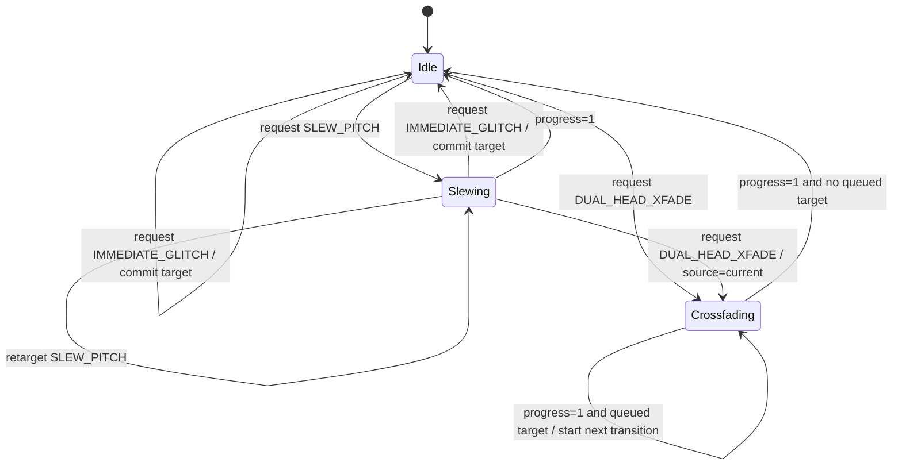

# WP-04 — Delay-time transition contract

**Status:** proposed architecture, host-testable  
**Date:** 2026-07-28  
**Depends on:** WP-01 contract; compatible with WP-03A fractional reader  
**Does not require:** Daisy hardware, tape model, reverse scheduler, freeze engine, UI or preset storage

## Executive decision

Delay-time changes must be explicit policies, not an accidental consequence of writing a new read index.

The engine needs two product-safe behaviours and one deliberately unsafe/creative behaviour:

1. **`SLEW_PITCH`** — one continuously moving read head; delay change intentionally creates pitch/Doppler behaviour.
2. **`DUAL_HEAD_XFADE`** — a new read head starts at the target delay and crossfades against the old head; intended for tap-tempo, preset and mode changes where a direct read jump would click.
3. **`IMMEDIATE_GLITCH`** — direct jump for debug or an explicitly named creative mode; never the silent default.

The transition service generates read plans and gains. It does not own delay memory, feedback filters, UI, MIDI or product presets.

## Problem statement

A variable delay contains two different user intentions that should not be conflated:

- **continuous motion:** chorus, flanger, vibrato, wow/flutter and tape-speed gestures;
- **discrete retargeting:** tap tempo, preset recall, subdivision change and mode entry.

A single smoothed delay parameter cannot satisfy both:

- fast smoothing preserves responsiveness but creates obvious pitch bends;
- slow smoothing hides clicks but produces long unwanted pitch drift;
- direct assignment creates discontinuities;
- crossfade avoids direct discontinuity but temporarily runs two heads and can comb or change energy.

The policy must therefore be selected by the caller from event semantics.

## Scope

### Included

- bounded state machine;
- normalized delay requests;
- single-head slew plan;
- dual-head crossfade plan;
- deterministic request handling while active;
- explicit transition completion;
- host-test vectors and metrics;
- no allocation in the processing path.

### Excluded

- interpolation kernel implementation;
- circular-buffer ownership;
- feedback processing;
- grain scheduling;
- reverse playback;
- tape transport physics;
- freeze capture;
- product-specific control mapping;
- target optimization.

## Terminology

| Term | Meaning |
|---|---|
| source delay | delay active before a transition request |
| target delay | requested final delay |
| head A | current/source read head |
| head B | target read head during dual-head transition |
| progress | normalized transition phase `[0, 1]` |
| queued target | last request retained while a dual-head transition is active |
| read plan | per-sample or per-frame set of delay positions and gains |

## Proposed API

This is an interface sketch, not yet a frozen header.

```cpp
namespace phh {

enum class DelayTransitionPolicy : std::uint8_t {
    SlewPitch,
    DualHeadCrossfade,
    ImmediateGlitch,
};

enum class CrossfadeLaw : std::uint8_t {
    LinearAmplitude,
    EqualPower,
};

struct DelayTransitionConfig {
    float minimum_delay_samples = 1.0F;
    float maximum_delay_samples = 96000.0F;
    std::uint32_t default_slew_samples = 2400U;
    std::uint32_t default_crossfade_samples = 2400U;
    CrossfadeLaw crossfade_law = CrossfadeLaw::EqualPower;
};

struct DelayReadPlan {
    float delay_a_samples = 1.0F;
    float delay_b_samples = 1.0F;
    float gain_a = 1.0F;
    float gain_b = 0.0F;
    bool second_head_active = false;
    bool transition_active = false;
    bool transition_completed = false;
};

class DelayTimeTransition final {
  public:
    [[nodiscard]] bool Prepare(const DelayTransitionConfig& config) noexcept;
    void Reset(float initial_delay_samples) noexcept;

    // Control-domain call. The requested duration is clamped to at least one
    // sample for a transition policy and ignored for ImmediateGlitch.
    [[nodiscard]] bool Request(float target_delay_samples,
                               DelayTransitionPolicy policy,
                               std::uint32_t duration_samples) noexcept;

    // Audio-domain call. No allocation, logging, blocking or unbounded work.
    [[nodiscard]] DelayReadPlan Next() noexcept;

    [[nodiscard]] float CurrentDelaySamples() const noexcept;
    [[nodiscard]] bool IsActive() const noexcept;
    [[nodiscard]] bool HasQueuedTarget() const noexcept;
};

} // namespace phh
```

## State machine



## Request arbitration

### Idle

- `SLEW_PITCH`: start from current delay.
- `DUAL_HEAD_XFADE`: head A=current; head B=target.
- `IMMEDIATE_GLITCH`: current=target immediately.

### Slew active

- another slew request retargets from the current instantaneous delay;
- a crossfade request uses the current instantaneous delay as head A;
- immediate glitch commits directly and terminates the transition.

### Crossfade active

V0.1 uses one **last-writer-wins queued target**:

- the active crossfade is not interrupted;
- the newest request replaces any previous queued request;
- when the active transition finishes, the queued request begins from the committed target;
- immediate glitch is allowed only through an explicit cancel-and-commit call or debug build, not ordinary `Request()` behaviour.

This avoids an unbounded request queue and avoids resetting gains mid-fade. The trade-off is bounded extra response latency during repeated tap/preset events.

## Delay normalization

All requests must be:

- finite;
- clamped to `[minimum_delay_samples, maximum_delay_samples]`;
- represented as float delay magnitude only, not an accumulating absolute sample position.

The fractional reader remains responsible for converting a bounded delay magnitude and write index into integer base plus fractional phase.

## Slew policy

For a requested duration `N >= 1`:

```text
delay[n] = source + (target - source) * n/N
```

V0.1 uses linear delay-position slew because its pitch behaviour is predictable and easy to verify.

Future alternatives, such as exponential or rate-limited motion, require separate musical and timing evidence.

### Slew acceptance

- exact source at first sample;
- exact target on completion;
- monotonic movement for monotonic request;
- no overshoot;
- finite output for all finite valid requests;
- deterministic retarget from current instantaneous delay.

## Dual-head crossfade policy

During the transition:

```text
wet[n] = gain_a[n] * read(delay_a)
       + gain_b[n] * read(delay_b)
```

The heads remain at fixed delay magnitudes for V0.1:

- head A = source delay;
- head B = target delay.

This avoids read-position motion during the crossfade. It does not guarantee absence of combing when both heads contain correlated content.

### Crossfade law

#### Linear amplitude

```text
gain_a = 1 - t
gain_b = t
```

Strength: cheap and deterministic.  
Weakness: approximately −6 dB midpoint for identical in-phase signals.

#### Equal power

```text
gain_a = cos(pi/2 * t)
gain_b = sin(pi/2 * t)
```

Strength: constant squared-gain sum.  
Weakness: two identical correlated heads can produce a level rise; transcendental evaluation must not be assumed free on target.

V0.1 host reference should use equal-power mathematics. The target implementation may use:

- a precomputed table;
- recursive oscillator/rotation;
- bounded polynomial approximation;
- direct `sinf/cosf` only if target profiling accepts it.

The chosen target implementation must match host golden weights within a documented tolerance.

## Integration boundary

```text
Control event
   ↓
DelayTimeTransition::Request()
   ↓
per-sample DelayReadPlan
   ↓
write-index → bounded delay magnitude → base + fraction
   ↓
CircularFractionalReader
   ↓
head A / head B samples
   ↓
transition gains
   ↓
feedback processor and wet mixer
```

### Important feedback decision

For a delay change, the feedback write should use **one defined transition output**, not independently feed both heads without a stability analysis.

Proposed V0.1:

```text
feedback_source = gain_a * head_a + gain_b * head_b
```

then:

```text
write = input_send * input + feedback_gain * condition(feedback_source)
```

This keeps one feedback state path. It can still produce temporary energy changes and must be tested at high feedback.

## Host test plan

### Contract tests

1. prepare rejects invalid bounds and zero durations where applicable;
2. reset clamps and produces idle single-head plan;
3. immediate policy commits target in one call;
4. slew starts at source and ends exactly at target;
5. slew is monotonic and bounded;
6. slew retarget starts from current instantaneous value;
7. crossfade keeps fixed source and target heads;
8. crossfade gains meet endpoint rules;
9. equal-power squared-gain sum remains within tolerance;
10. crossfade completes after exact configured sample count;
11. repeated requests use one last-writer-wins queued target;
12. NaN/Inf requests are rejected without corrupting state;
13. minimum and maximum delays remain valid;
14. zero/one-sample edge cases are explicit;
15. reset during active transition produces deterministic idle state.

### Signal tests

Use a synthetic circular history and independent reference implementation.

1. **DC/identical heads:** measure amplitude envelope for both laws.
2. **Uncorrelated heads:** verify expected power behaviour statistically.
3. **Sine, related phase:** sweep source-target offset and measure peak/dip.
4. **Impulse:** verify no illegal memory/index request.
5. **Feedback loop:** measure transient peak at feedback 0, 0.5, 0.9 and 0.99.
6. **Rapid requests:** verify bounded queue and no state explosion.
7. **Transition extremes:** 1 sample, 48 samples, 50 ms, 250 ms.

## Characterization metrics

| Metric | Purpose |
|---|---|
| maximum plan discontinuity | detect state/API jumps |
| gain-square error | equal-power implementation accuracy |
| identical-signal midpoint gain | document correlated-head behaviour |
| peak transition output | headroom requirement |
| crossfade duration error | scheduler correctness |
| queued-request latency | UX implication |
| feedback transient peak | stability/headroom |
| host relative cost | only a rough algorithm comparison |
| target cycles | later WP-07/Daisy evidence |

## Initial product targets

These are proposed starting points, not frozen values.

| Event | Policy | Duration target |
|---|---|---:|
| normal knob motion | `SLEW_PITCH` | 10–50 ms equivalent motion smoothing |
| tape-time gesture | `SLEW_PITCH` | parameter-dependent, musically exposed |
| tap-tempo change | `DUAL_HEAD_XFADE` | 50–150 ms |
| preset recall | `DUAL_HEAD_XFADE` | 50–250 ms |
| subdivision change | `DUAL_HEAD_XFADE` | 30–100 ms |
| deliberate glitch | `IMMEDIATE_GLITCH` | immediate, explicit mode only |

Pilot-client audition must decide actual ranges.

## Cross-product reuse

### Delay pedal

- tap-tempo and subdivision changes;
- preset recall;
- mode entry/exit;
- tape versus clean time gestures.

### Multi-FX pedal

- chorus/flanger base-delay changes;
- rotary and modulation preset transitions;
- compact ambience pre-delay changes.

### Synth Harness

- deterministic transition stimulus;
- click/pop and transient measurement;
- regression vectors;
- diagnostic distinction between policy and interpolation defects.

## Feasibility and cost

| Item | Estimate |
|---|---:|
| host contract implementation | 1–2 days |
| host signal characterization | 1–2 days |
| integration with fractional reader | 1–2 days after PR #2 resolution |
| target profiling | 0.5–1 day with Daisy harness |
| hardware BOM | 0 CHF |
| product risk reduced | high for tap/preset/mode changes |

## Independent critical review

### Main risks

1. **Equal-power is not equal loudness for correlated heads.**
   A crossfade between two taps of the same history can rise or dip depending on phase.
2. **Dual-head transition doubles read cost temporarily.**
   Multi-head/reverse modes may multiply this further.
3. **Queueing improves continuity but adds control latency.**
   Pilot users may prefer interruption or a shorter transition.
4. **One feedback-source blend is a design choice.**
   It needs high-feedback transient tests.
5. **A clean mathematical transition may still sound wrong.**
   Audition with guitar, bass, synth transients and sustained material is required.
6. **The service can become over-general.**
   V0.1 supports exactly three policies and one queued request. More is HOLD.

### Rejected for V0.1

- arbitrary transition curves;
- multiple queued events;
- dynamic allocation;
- automatic policy inference from numerical delta alone;
- hidden switch between slew and crossfade;
- tape transport semantics inside this service;
- reverse/grain transition scheduling.

## Acceptance criteria

WP-04 passes its host gate when:

- the state machine and request arbitration are implemented exactly;
- all contract tests pass on Linux, macOS and Windows;
- no heap, locks, logging or target headers are required;
- endpoint, duration and finite-value properties pass;
- equal-power reference error is bounded;
- signal characterization artifact is parseable and schema-checked;
- feedback transient tests expose peak values rather than hiding them;
- no claim of click-free or pop-free behaviour is made without hardware/audio measurement;
- PR #2 remains an explicit dependency for fractional-reader integration, not silently copied code.

## Next action

Implement the host-only `DelayTimeTransition` contract and tests on a branch from `main`, keeping fractional-reader integration as a later stacked change after PR #2 receives independent review.
