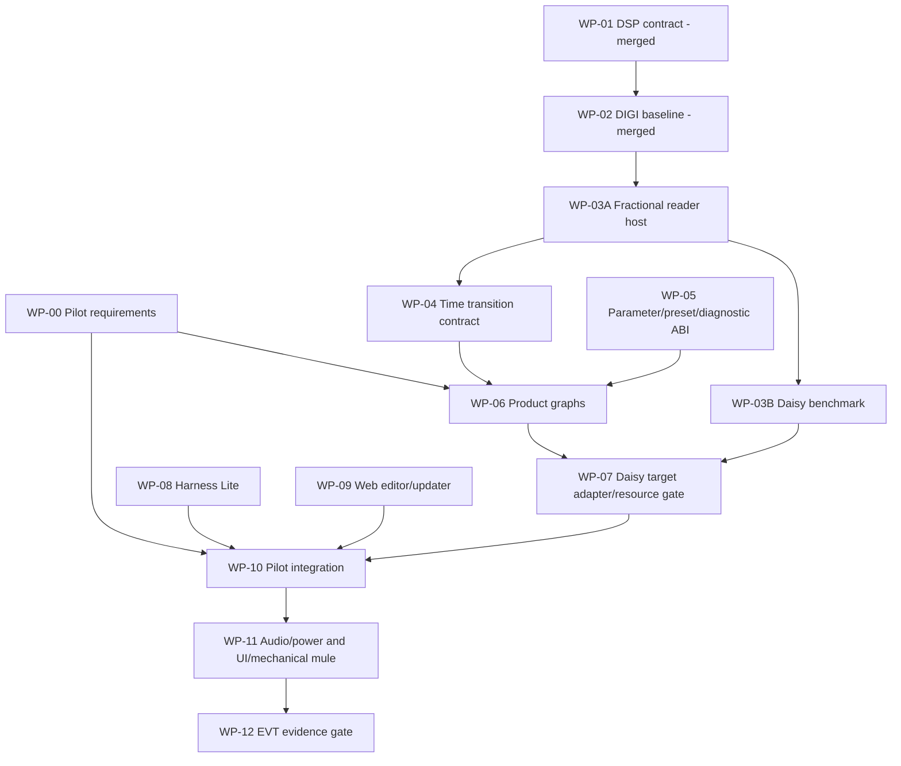

# Pedal, Multi-FX, and Synth Harness development plan

**Status:** working development plan  
**Date:** 2026-07-28  
**Repository baseline:** `main` at `1f52f7ca4bb6568707de40793e40165a66a6ed60`  
**Scope:** delay pedal, separate multi-FX pedal, and reusable Synth Harness infrastructure

## Executive decision

Development must not stop whenever physical Daisy access is unavailable.

Hardware measurements are evidence gates for the claims they govern, not global permission gates for unrelated architecture, host DSP, preset, UI, diagnostic, fixture, documentation, and commercial work.

The programme therefore uses **parallel lanes with explicit merge gates**:

```text
DSP primitives ───────────────┐
Embedded profiling ───────────┼──> product graph integration
Parameters/presets ───────────┤
Pilot-client requirements ────┤
Harness/diagnostics ──────────┤
Hardware/mechanical ──────────┘
```

A lane may proceed when its inputs are known. It may not convert an unmeasured assumption into a product claim merely because another lane is moving slowly.

## Product boundary

The two requested pedals remain separate products:

### Delay pedal

Delay-centric compact/full-featured family. Compact target modes:

- DIGI;
- TAPE;
- MOD;
- REV;
- FREEZE.

Reverb-like diffusion is subordinate delay processing unless a later product decision changes the identity.

### Multi-FX pedal

A companion focused on:

- gate and dynamics;
- drive and tone shaping;
- wah/filter;
- chorus, flanger, phaser, tremolo and rotary;
- bounded room/plate ambience if it earns CPU, RAM, UI and product cost.

Long echo, tape, reverse, freeze and looping remain in the delay product.

### Synth Harness

A shared engineering layer for:

- users: presets, editor, updater, routing and diagnostics;
- developers: portable DSP, target adapters, profiling and golden vectors;
- repairers: service mode, stimulus, capture, recovery and fault evidence;
- small manufacturers: calibration, factory test, versioning and traceability.

The project documents already require separate products with shared validated foundations, not one oversized effect workstation.

## Evidence labels

| Label | Meaning |
|---|---|
| `VERIFIED` | Inspected source, passing test, measured hardware, or saved build evidence |
| `SUPPORTED` | Strong source support but not yet verified on the current target |
| `PROPOSED` | Selected engineering direction awaiting implementation or measurement |
| `ESTIMATE` | Cost, schedule or performance estimate with stated assumptions |
| `HOLD` | Blocked by missing evidence, dependency, hardware, license or product decision |

## Current state

| Work item | State | Evidence | Remaining gate |
|---|---|---|---|
| WP-01 Portable DSP contract/static graph | `VERIFIED HOST` | merged PR #1; scoped tests passed | target integration |
| WP-02 DIGI integer delay baseline | `VERIFIED HOST` | merged PR #1; impulse/wrap/feedback/reset tests | fractional read and target timing |
| WP-03A Linear/cubic fractional reader | `DRAFT / HOST VERIFIED` | PR #2; maintained CI and validated artifact | independent re-review and merge decision |
| WP-03B Daisy reader benchmark | `NOT_RUN` | specification exists | local build, flash, DWT, SRAM/SDRAM evidence |
| Pilot-client requirements | `PARTIAL` | two real requests: delay and multi-FX | structured interviews and signed acceptance boundary |
| Harness Lite | `SPECIFIED` | host-assisted fixture architecture | prototype and first real fault caught |
| Product hardware | `ALPHA BASELINE` | existing 125B Rev6 source | as-built audit and measurements |

## Dependency graph



## Parallel development lanes

### Lane A — Portable DSP and timing semantics

May proceed without hardware except where explicitly marked.

1. WP-03A fractional-reader review closure.
2. WP-04 delay-time transition contract.
3. Host golden vectors for dual-head crossfade and intentional slew.
4. Shared feedback processor contract.
5. Product-specific mode adapters.

### Lane B — Embedded target and performance

Requires local Daisy access.

1. WP-03B DWT benchmark.
2. SRAM versus SDRAM.
3. checked versus normalized indexing.
4. block and multi-head stress.
5. callback average, p99.9, maximum and overrun evidence.

### Lane C — Product model and UX

May proceed from client interviews and host prototypes.

1. pilot requirement capture;
2. stable parameter IDs, units, curves and smoothing;
3. tap/MIDI/knob arbitration;
4. bypass, trails, freeze and mode-transition semantics;
5. control allocation and soft takeover;
6. preset schema and migration.

### Lane D — Synth Harness and serviceability

May proceed with a PC, audio interface and inexpensive fixture modules.

1. result schema;
2. serial/USB diagnostic contract;
3. power/current and relay-routing prototype;
4. product adapter identity/interlock;
5. audio/MIDI/control test sequences;
6. repair and factory reports.

### Lane E — Hardware, mechanics and commercial validation

May proceed through audits, CAD and interviews before a final PCB.

1. Rev6 as-built audit;
2. input/output headroom and power plan;
3. enclosure and panel mule;
4. BOM/cost model at prototype, 10, 50 and 100 units;
5. production/service access;
6. pilot quotes and documentation permissions.

## Work-package plan

### WP-00 — Pilot-client requirements

**Goal:** replace guessed workflows with two bounded product briefs.

**Deliverables:**

- setup and use-case description;
- must-have and reject lists;
- reference products/sounds;
- I/O, controls, presets, MIDI, stereo and budget;
- acceptance audition;
- permission to document the case.

**Gate:** no product PCB or final panel before both briefs exist.

**Estimated effort:** 2 × 45-minute interviews plus one day synthesis.

---

### WP-01 — Portable DSP contract and static graph

**State:** merged.

**Result:** block processing, caller-owned arena, explicit lifecycle, immutable parameter snapshots and scoped host tests.

**Open debt:** layout enforcement, target profiling and legacy repository health.

---

### WP-02 — DIGI integer-delay baseline

**State:** merged.

**Result:** correct input injection/feedback separation, filtered feedback, deterministic memory and host vectors.

**Open debt:** fractional read, time transitions, target timing and hardware audio evidence.

---

### WP-03A — Fractional-reader host characterization

**State:** draft PR #2.

**Scope:** linear and cubic Lagrange correctness, static error, cascade prediction, modulated ideal-reference residual, boundary behaviour and host-relative timing.

**Merge gate:** independent re-review of the revised artifact and API.

---

### WP-03B — Daisy fractional-reader benchmark

**State:** hardware pending.

**Scope:**

- DWT cycle counter;
- integer/linear/cubic;
- SRAM/SDRAM;
- generic modulo versus normalized fast path;
- static and precomputed moving head;
- median, p99.9, maximum and overrun;
- exact SHA/toolchain/MAP evidence.

**Important:** this gate determines embedded performance claims. It does not block WP-04, WP-05, client requirements or Harness Lite software.

---

### WP-04 — Delay-time transition contract

**State:** active specification.

**Question:** how should the engine move between delay times without making all time changes share one accidental sonic behaviour?

**Required policies:**

- `SLEW_PITCH`: one head, deliberate Doppler/pitch gesture;
- `DUAL_HEAD_XFADE`: discontinuous target change without direct read-position jump;
- `IMMEDIATE_GLITCH`: explicit expert/debug policy only;
- bounded request handling while a transition is already active.

**Deliverables:** state machine, read-plan API, test vectors, transition metrics and integration boundary.

**No product UI decision:** the policy remains internal until pilot requirements allocate controls.

---

### WP-05 — Shared parameter, preset and diagnostic ABI

**Goal:** one stable representation for delay, multi-FX, editor, service and factory tools.

**Core records:**

```text
DeviceIdentity
ModuleDescriptor
ParameterDescriptor
ParameterSnapshot
GraphDescriptor
PresetBlob
CalibrationRecord
DiagnosticReport
FirmwareCompatibility
```

**Gate:** schema versioning, CRC/corruption handling and migration tests before nonvolatile use.

---

### WP-06 — Bounded product graphs

#### Delay graph

```text
input conditioning
→ delay history service
→ read/mode adapter
→ feedback processor
→ wet processor
→ mixer/safety
```

#### Multi-FX graph

```text
input conditioning
→ gate
→ PRE region
→ EQ/filter
→ MOTION region
→ optional SPACE
→ output/safety
```

**Gate:** allowed-combination matrix and declared CPU/RAM/tail/latency for each graph.

---

### WP-07 — Daisy target adapter and resource gate

**Goal:** integrate portable modules without importing UI/storage work into the audio callback.

**Deliverables:**

- audio adapter;
- immutable block snapshot exchange;
- memory placement;
- target profiling;
- deadline/overrun telemetry;
- reproducible build and binary/MAP evidence.

---

### WP-08 — Harness Lite

**Goal:** host-assisted test and service fixture using an external audio interface.

**Functions:** protected DUT power, V/I measurement, relay routing, MIDI, expression/footswitch stimulus, reset/DFU/UART/SWD, adapter identification and evidence capture.

**Commercial gate:** do not sell as a standard product until it has caught real defects in both pilot pedals and one independent developer/repair case.

---

### WP-09 — Web editor, updater and service UI

**Goal:** descriptor-driven browser tool without making the pedals browser-dependent.

**Functions:** preset backup/restore, parameter editing, firmware identity, diagnostics, calibration guidance and recovery.

**Gate:** protocol validation, backward compatibility and failure/recovery tests.

---

### WP-10 — Pilot integrations

**Delay pilot:** first audible DIGI plus one differentiating mode selected from requirements.

**Multi-FX pilot:** fixed graph with one PRE and one MOTION effect plus utility chain.

**Gate:** both pilots generate reusable module, preset, diagnostic and test evidence rather than bespoke callbacks.

---

### WP-11 — Audio/power core and UI/mechanical mule

**Goal:** prove the actual product interfaces before production CAD.

**Evidence:** input impedance/headroom, output drive, residual noise, power/ripple, bypass transient, display/control coupling, 1:1 panel ergonomics and assembly access.

---

### WP-12 — EVT integrated evidence

**Gate:** clean reproducible build, zero deadline misses in released graphs, measured audio/power, preset and bypass transitions, soak tests, mechanical fit, documented BOM and risk closure.

## Schedule estimate

The schedule below assumes one engineer, part-time evening/weekend work, existing Daisy hardware, and no custom production PCB during the first software gates.

| Milestone | Focused engineering time | Calendar estimate |
|---|---:|---:|
| WP-00 client briefs | 1–2 days | 1 week |
| WP-03B target benchmark | 2–3 days | dependent on board access |
| WP-04 transition contract + host vectors | 3–6 days | 1–2 weeks |
| WP-05 ABI | 3–5 days | 1 week |
| WP-06 first product graphs | 5–10 days | 2–4 weeks |
| WP-07 first Daisy integration | 5–10 days | 2–4 weeks |
| WP-08 Harness Lite bench prototype | 5–10 days | 2–4 weeks |
| WP-09 minimal editor/service UI | 5–12 days | 2–5 weeks |
| WP-10 two pilot prototypes | 15–30 days | 2–4 months |
| WP-11 integrated hardware/UI mule | 15–30 days | 2–4 months |

These are estimates, not commitments. Mechanical supply, client iteration and hardware faults dominate calendar uncertainty.

## Cost envelope

| Item | Prototype estimate |
|---|---:|
| Daisy/adapter/debug hardware already owned | 0–100 CHF incremental |
| Harness Lite modules and connectors | 100–250 CHF |
| Pedal prototype passives/boards/mechanics per unit | 150–350 CHF before engineering labour |
| Enclosure machining/printing per early unit | 50–180 CHF |
| Audio interface/test equipment | existing where possible |

No commercial price should be frozen before real assembly/test time and pilot feedback.

## Commercial extraction path

The pilot work should produce saleable infrastructure in this order:

1. **custom effect prototype** for musicians;
2. **product-extension sprint** for small manufacturers;
3. **debug and test sprint** for developers/repairers;
4. reusable firmware/diagnostic SDK;
5. standard Harness adapters and fixture;
6. finished delay and multi-FX products.

The first commercial advantage is not algorithm novelty alone. It is making boutique audio products easier to build, update, diagnose and support.

## Stop conditions

Stop or hold the affected lane when:

- a license or provenance boundary is unclear;
- target performance has no reproducible evidence;
- a schematic/BOM/footprint/CPL mismatch blocks hardware confidence;
- pilot requirements conflict materially;
- a product graph cannot retain the required deadline margin;
- fixture protection cannot bound fault energy;
- a price assumes free engineering, assembly or warranty labour.

Do not stop unrelated lanes merely because one condition applies elsewhere.

## Immediate sequence

1. Save this dependency-safe plan.
2. Complete WP-04 specification and host-test design.
3. Capture the two pilot requirements.
4. Run WP-03B when Daisy hardware becomes available.
5. Feed target numbers into WP-04/WP-06 resource decisions.

The project now has a route that continues even when the board is not connected, which is apparently a feature project plans need to state explicitly because humans otherwise turn a missing USB cable into programme governance.
