# DAFX to DaisySP Library Implementation Plan

**Date:** 2026-01-10
**Version:** 1.1
**Status:** Style Guide Compliant Draft

---

## Table of Contents

1. [Project Description](#1-project-description)
2. [Initial Phase Documentation](#2-initial-phase-documentation)
3. [Scope Definition](#3-scope-definition)
4. [Library Architecture](#4-library-architecture)
5. [Hardware Constraints](#5-hardware-constraints)
6. [Final Deliverables](#6-final-deliverables)
7. [Algorithm Roadmap](#7-algorithm-roadmap)
8. [Success Criteria](#8-success-criteria)
9. [Style Guide Compliance](#9-style-guide-compliance)

---

## 1. Project Description

### 1.1 Purpose

This project creates a **portable DSP algorithm library** derived from the DAFX (Digital Audio Effects, 2nd Edition) textbook by Udo Zölzer, targeting the Daisy Seed embedded platform while maintaining **complete hardware independence**.

The library bridges the gap between academic DSP algorithms documented in DAFX and practical embedded audio implementations, enabling developers to deploy professional-grade audio effects on Daisy Seed hardware without being constrained to specific hardware configurations.

### 1.2 Value Proposition

| Benefit | Description |
|---------|-------------|
| **Academic Rigor** | Algorithms derived from peer-reviewed DSP textbook with mathematical foundations |
| **Hardware Independence** | Pure C++ DSP modules work across Daisy Pod, Field, Patch, Petal, or custom designs |
| **DaisySP Compatibility** | Follows established DaisySP API patterns for seamless integration |
| **Real-time Performance** | Optimized for ARM Cortex-M7 constraints at 96kHz/24-bit audio |
| **Open Source** | Extensible codebase with clear documentation for community contributions |

### 1.3 Problem Statement

The existing DaisySP library provides ~25 DSP algorithms covering approximately 35% of common audio effect requirements. The remaining 65% gap includes essential effects like:

- **Parametric EQ and shelving filters** - standard mixing tools
- **Vibrato and ring modulation** - classic synthesis effects
- **Noise gate** - essential dynamics processing
- **Tube/valve simulation** - popular guitar/vocal effect
- **Spectral effects** - robotization, whisperization

This library fills these gaps with well-documented, tested implementations.

---

## 2. Initial Phase Documentation

### 2.1 Source Materials

#### Primary References

| Material | Location | Purpose |
|----------|----------|---------|
| DAFX Book (2nd Ed.) | `docs/DAFX- Digital Audio Effects - 2ed 2011 - Udo Zölzer.pdf` | Algorithm theory and equations |
| DAFX MATLAB Code | `DAFX-MATLAB/M_files_chap*/` | Reference implementations |
| DaisySP Reference | `docs/daisysp_reference.pdf` | API patterns and conventions |
| DaisySP Source | `docs/repomix-output-electro-smith-DaisySP.txt` | Code structure reference |
| Excel Analysis | `docs/DAFX_Analysis.xlsx` | Algorithm categorization |

#### DAFX Chapters and Target Algorithms

| Chapter | Topic | Key Algorithms |
|---------|-------|----------------|
| Ch. 2 | Filters | Shelving, Peak/Parametric EQ, Allpass, Comb filters |
| Ch. 3 | Modulation | Vibrato, Ring modulation, Leslie simulation |
| Ch. 4 | Dynamics | Compressor/Expander, Noise Gate, Tube distortion |
| Ch. 5 | Spatial | Stereo panning, FDN reverb, Delay effects |
| Ch. 6 | Time-domain | SOLA time stretch, PSOLA pitch shift |
| Ch. 7 | Spectral | Phase vocoder, Robotization, Whisperization |
| Ch. 9 | Analysis | YIN pitch detection, Spectral centroid |
| Ch. 12 | Virtual Analog | Wah-wah, Tone stack |

### 2.2 Development Tools and Toolchain

#### Required Software

```
- ARM GCC Toolchain (arm-none-eabi-gcc 10.3+)
- CMake 3.16+
- Python 3.9+ (for execution scripts)
- Git for version control
- VS Code with C/C++ extension (recommended)
```

#### Optional Tools

```
- MATLAB/Octave (for algorithm verification)
- Daisy Toolchain (via daisy_tool or Arduino)
- JTAG debugger (ST-Link V3)
```

### 2.3 Prerequisite Knowledge

| Area | Level | Resources |
|------|-------|-----------|
| C++ (Modern) | Intermediate | Templates, namespaces, const-correctness |
| Digital Signal Processing | Intermediate | Z-transforms, filter design, sampling theory |
| Embedded Systems | Basic | Memory constraints, real-time requirements |
| Audio Engineering | Basic | Sample rates, bit depth, audio effects terminology |

---

## 3. Scope Definition

### 3.1 In-Scope Algorithm Categories

```mermaid
flowchart TD

    subgraph DAFX_View["🎛️ DAFX – Audio Effects Library"]

        A[DAFX Core]:::core

        %% Filters
        A --> B[Filters]:::filters
        B --> B1[Shelving]
        B --> B2[Parametric EQ]
        B --> B3[Comb]

        %% Modulation
        A --> C[Modulation]:::mod
        C --> C1[Vibrato]
        C --> C2[Ring Mod]

        %% Dynamics
        A --> D[Dynamics]:::dyn
        D --> D1[Noise Gate]
        D --> D2[Compressor / Expander]

        %% Spatial
        A --> E[Spatial]:::spatial
        E --> E1[Stereo Pan]
        E --> E2[FDN Reverb]

        %% Time Domain
        A --> F[Time-Domain]:::time
        F --> F1[SOLA Time]
        F --> F2[PSOLA]

        %% Spectral
        A --> G[Spectral*]:::spectral
        G --> G1[Robotization]
        G --> G2[Whisperization]

        %% Analysis
        A --> H[Analysis]:::analysis
        H --> H1[YIN Pitch]

        %% Virtual Analog
        A --> I[Virtual Analog]:::analog
        I --> I1[Wah-Wah]
        I --> I2[Tone Stack]

    end

    %% ===== Styling =====
    classDef core fill:#2c3e50,color:#ffffff,stroke:#1a252f,stroke-width:2px
    classDef filters fill:#3498db,color:#ffffff
    classDef mod fill:#9b59b6,color:#ffffff
    classDef dyn fill:#e74c3c,color:#ffffff
    classDef spatial fill:#1abc9c,color:#ffffff
    classDef time fill:#f39c12,color:#ffffff
    classDef spectral fill:#f1c40f,color:#000000,stroke:#d4ac0d,stroke-width:2px
    classDef analysis fill:#95a5a6,color:#000000
    classDef analog fill:#e67e22,color:#ffffff
```



*Note: Spectral effects marked in yellow require FFT and have higher CPU requirements

### 3.2 Hardware Abstraction Requirements

The library **MUST NOT** depend on:

- Specific Daisy hardware variants (Pod, Field, Patch, Petal)
- GPIO pin configurations
- Hardware peripheral assignments (ADC/DAC channels)
- Physical control mappings (knobs, buttons, LEDs)

The library **MUST** provide:

- Pure DSP modules with Init/Process pattern
- Configurable sample rate initialization
- Block-based and sample-by-sample processing options
- Clear parameter ranges and defaults

### 3.3 API Design Principles

Following DaisySP conventions:

```cpp
namespace daisysp
{
class EffectName
{
public:
    EffectName() {}
    ~EffectName() {}
    
    // Initialize with sample rate, set defaults
    void Init(float sample_rate);
    
    // Process single sample
    float Process(float in);
    
    // Optional: Process stereo
    void Process(float in_left, float in_right, 
                 float* out_left, float* out_right);
    
    // Simple setters - inline for performance
    inline void SetParam(float param) { param_ = param; }
    
    // Complex setters - require recalculation
    void SetComplexParam(float param);
    
private:
    float sample_rate_;
    float param_;
    // State variables...
};
} // namespace daisysp
```

### 3.4 Out of Scope

The following are **explicitly excluded**:

| Category | Reason |
|----------|--------|
| **Sinusoidal/SMS Models** | Too computationally intensive for embedded real-time |
| **Source Separation (NMF, ICA)** | Requires offline processing |
| **Automatic Mixing** | Requires multi-track context |
| **Ambisonics (3D)** | Specialized multichannel hardware |
| **Wave Digital Filters** | Very high complexity, low priority |
| **LPC Cross-Synthesis** | High computational requirements |
| **Hardware-specific examples** | Library is hardware-agnostic |

---

## 4. Library Architecture

### 4.1 Directory Structure

```
DAFX_2_Daisy_lib/
├── src/
│   ├── effects/           # Audio effect modules
│   │   ├── tube.cpp       # ✓ Implemented
│   │   ├── tube.h
│   │   ├── shelving.cpp   # Planned
│   │   ├── shelving.h
│   │   └── ...
│   ├── filters/           # Filter modules
│   │   ├── peakfilter.cpp
│   │   └── ...
│   ├── dynamics/          # Dynamics processors
│   │   ├── noisegate.cpp
│   │   └── ...
│   ├── modulation/        # Modulation effects
│   │   ├── vibrato.cpp
│   │   └── ...
│   ├── spatial/           # Spatial processing
│   │   └── ...
│   ├── analysis/          # Analysis tools
│   │   └── ...
│   └── utility/           # Helper classes
│       └── ...
├── tests/                 # Unit tests
├── examples/              # Usage examples (hardware-agnostic)
├── docs/                  # Reference documentation
├── directives/            # SOP documents
├── execution/             # Python automation scripts
├── plans/                 # Planning documents
├── DAFX-MATLAB/          # Reference implementations
├── CHECKPOINT.md         # Project state
├── dafx_bugs.md          # Bug log
└── CMakeLists.txt        # Build configuration
```


### 4.2 Module Categories


*Green = Implemented, Others = Planned

### 4.3 Processing Models

#### Sample-by-Sample (Primary)

```cpp
// Per-sample processing - lowest latency
void AudioCallback(float* in, float* out, size_t size) {
    for (size_t i = 0; i < size; i++) {
        out[i] = effect.Process(in[i]);
    }
}
```

#### Block-Based (Where Required)

```cpp
// Block processing for FFT-based effects
void AudioCallback(float* in, float* out, size_t size) {
    effect.ProcessBlock(in, out, size);
}
```

---

## 5. Hardware Constraints

### 5.1 Daisy Seed Specifications

| Parameter | Value |
|-----------|-------|
| **MCU** | STM32H750 (ARM Cortex-M7) |
| **CPU Clock** | 480 MHz |
| **Internal RAM** | 1 MB (512KB AXI + TCM) |
| **External SDRAM** | 64 MB (optional) |
| **External Flash** | 8 MB QSPI |
| **Audio Codec** | 24-bit, up to 96 kHz |
| **FPU** | Single and Double precision |
| **DSP Instructions** | ARM SIMD extensions |

### 5.2 Memory Budget Guidelines

| Effect Type | Target RAM | Max Buffer |
|-------------|-----------|------------|
| Simple Filter | < 100 bytes | N/A |
| Delay-based | < 50 KB | 0.5s @ 48kHz |
| FFT-based | < 16 KB | 2048 samples |
| Complex reverb | < 100 KB | Multiple delays |

### 5.3 CPU Budget Guidelines

| Operation | Target CPU% |
|-----------|-------------|
| Single simple effect | < 5% |
| Single complex effect | < 25% |
| Effect chain (4-6 effects) | < 50% |
| Total processing | < 70% |

*Reserve 30% for audio I/O and housekeeping

### 5.4 Real-time Constraints

```
At 48 kHz, 64-sample buffer:
- Callback period: 1.33 ms
- Available cycles per callback: 640,000 @ 480 MHz
- Available cycles per sample: 10,000

At 96 kHz, 48-sample buffer:
- Callback period: 0.5 ms
- Available cycles per callback: 240,000 @ 480 MHz
- Available cycles per sample: 5,000
```

---

## 6. Final Deliverables

### 6.1 Library Components

| Deliverable | Description | Format |
|-------------|-------------|--------|
| **Core Library** | 15-20 DSP modules | C++ source files |
| **Header Files** | Public API definitions | `.h` files with docstrings |
| **CMake Build** | Cross-platform build system | `CMakeLists.txt` |
| **Unit Tests** | Automated validation | Google Test or Catch2 |
| **Examples** | Hardware-agnostic demos | C++ with comments |

### 6.2 Documentation Standards

Each module must include:

```cpp
// # ModuleName
// Brief one-line description
//
// Detailed description of the algorithm, its origin (DAFX reference),
// and typical use cases.
//
// ## Parameters
// - param1: Description (range, default)
// - param2: Description (range, default)
//
// ## Example
// ~~~~
// ModuleName effect;
// effect.Init(48000.0f);
// effect.SetParam(0.5f);
// float out = effect.Process(in);
// ~~~~
//
// ## References
// - DAFX 2nd Ed., Chapter X, Section Y.Z
// - Original MATLAB: filename.m
```

### 6.3 Testing Methodology

#### Unit Testing Framework

```cpp
TEST(ShelvingFilter, LowShelf_BoostAt100Hz) {
    LowShelving shelf;
    shelf.Init(48000.0f);
    shelf.SetFrequency(100.0f);
    shelf.SetGain(6.0f);  // +6 dB
    
    // Generate test tone at 50 Hz
    // Verify output is approximately +6 dB
    // Allow ±0.5 dB tolerance
}
```

#### MATLAB Reference Validation

```python
# execution/validate_effect.py
# Compare C++ output with MATLAB reference
def validate_against_matlab(cpp_output, matlab_output, tolerance_db=0.5):
    # Load both outputs
    # Compute difference in dB
    # Assert within tolerance
```

### 6.4 Example Implementation Pattern

```cpp
// examples/example_shelving.cpp
// Hardware-agnostic example showing LowShelving usage

#include "daisysp.h"
using namespace daisysp;

// This example can be adapted to any Daisy hardware
// by providing appropriate Init() and AudioCallback() bindings

LowShelving bass_shelf;
LowShelving treble_shelf;

void InitEffects(float sample_rate) {
    bass_shelf.Init(sample_rate);
    bass_shelf.SetFrequency(200.0f);
    bass_shelf.SetGain(3.0f);  // +3 dB bass boost
    
    treble_shelf.Init(sample_rate);
    treble_shelf.SetFrequency(4000.0f);
    treble_shelf.SetGain(-2.0f);  // -2 dB treble cut
}

float ProcessSample(float in) {
    float out = bass_shelf.Process(in);
    out = treble_shelf.Process(out);
    return out;
}
```

---

## 7. Algorithm Roadmap

### 7.1 Phase 1: Foundation (Tier 1 - High Priority)

Essential effects with low/medium complexity.

| Priority | Effect | MATLAB Source | Complexity | Status |
|----------|--------|---------------|------------|--------|
| 1 | Tube Distortion | `tube.m` | Medium | ✅ Done |
| 2 | Low Shelving Filter | `lowshelving.m` | Low | 📋 Planned |
| 3 | High Shelving Filter | (derived) | Low | 📋 Planned |
| 4 | Peak/Parametric EQ | `peakfilt.m` | Low | 📋 Planned |
| 5 | Vibrato | `vibrato.m` | Low | 📋 Planned |
| 6 | Ring Modulator | (simple) | Very Low | 📋 Planned |
| 7 | Stereo Panning | `stereopan.m` | Very Low | 📋 Planned |
| 8 | Noise Gate | `noisegt.m` | Medium | 📋 Planned |
| 9 | CryBaby Wah | Ch. 12 | Medium | 📋 Planned |
| 10 | Tone Stack | Ch. 12 | Medium | 📋 Planned |

### 7.2 Phase 2: Enhancement (Tier 2 - Medium Priority)

Useful effects with medium/high complexity.

| Priority | Effect | MATLAB Source | Complexity |
|----------|--------|---------------|------------|
| 11 | YIN Pitch Detection | `yinDAFX.m` | High |
| 12 | Robotization | `VX_robot.m` | Medium |
| 13 | Whisperization | `VX_whisper.m` | Medium |
| 14 | SOLA Time Stretch | `TimeScaleSOLA.m` | High |
| 15 | FDN Reverb | `delaynetwork.m` | High |
| 16 | Compressor/Expander | `compexp.m` | Medium |
| 17 | Universal Comb Filter | `unicomb.m` | Low |

### 7.3 Phase 3: Advanced (Tier 3 - Optional)

Specialized effects for specific use cases.

| Effect | MATLAB Source | Complexity | Notes |
|--------|---------------|------------|-------|
| Phase Vocoder Pitch | `VX_pitch_pv.m` | Very High | Requires FFT |
| LP-IIR Comb | `lpiircomb.m` | Medium | Reverb building block |
| Spectral Filtering | `VX_filter.m` | High | Requires FFT |
| Crosstalk Canceller | `crosstalkcanceler.m` | Medium | Stereo correction |

### 7.4 Implementation Order Visualization


---

## 8. Success Criteria

### 8.1 Minimum Viable Product (MVP)

The project reaches MVP when:

- [ ] **10 core effects implemented** from Phase 1
- [ ] All effects compile without warnings
- [ ] All effects have unit tests passing
- [ ] Documentation complete for all modules
- [ ] At least 3 hardware-agnostic examples

### 8.2 Production-Ready Criteria

| Criterion | Metric | Target |
|-----------|--------|--------|
| **Code Quality** | Compiler warnings | 0 |
| **Test Coverage** | Lines covered | > 80% |
| **Documentation** | Modules documented | 100% |
| **Performance** | Max CPU per effect | < 25% |
| **Memory** | Max RAM per effect | < 50 KB |
| **Accuracy** | vs MATLAB reference | ±0.5 dB |

### 8.3 Acceptance Testing

Each implemented effect must pass:

1. **Compilation Test**: Builds with ARM GCC without errors/warnings
2. **Unit Test**: Automated tests pass
3. **Reference Test**: Output matches MATLAB within tolerance
4. **Performance Test**: Meets CPU/memory budgets on Daisy Seed
5. **Integration Test**: Works in example Daisy project

### 8.4 Definition of Done

An effect is considered complete when:

```
□ Header file with documentation comments
□ Implementation file with Init() and Process()
□ Unit tests written and passing
□ MATLAB reference validation script
□ Example usage code
□ Entry in CHECKPOINT.md
□ No entries in dafx_bugs.md (or all resolved)
```

---

## Appendix A: Reference Implementation Pattern

The [`tube.cpp`](../src/effects/tube.cpp) / [`tube.h`](../src/effects/tube.h) implementation serves as the reference pattern for all future effects. Key patterns to follow:

1. **Namespace**: All classes in `daisysp` namespace
2. **Initialization**: `Init(float sample_rate)` sets defaults
3. **Processing**: `Process(float in)` is single-sample
4. **Setters**: Simple setters are `inline`, complex ones are not
5. **State**: Private member variables with `_` suffix
6. **Header**: Markdown-style documentation at top

---

## Appendix B: MATLAB to C++ Translation Guide

| MATLAB | C++ |
|--------|-----|
| `x(n)` | `x[n-1]` (0-indexed) |
| `zeros(1,N)` | `float x[N] = {0}` |
| `exp(-x)` | `std::exp(-x)` |
| `abs(x)` | `std::abs(x)` or `fabsf(x)` |
| `sin(x)` | `std::sin(x)` or `sinf(x)` |
| Row vector | 1D array |
| Matrix | 2D array or flattened |
| Buffer concatenation | Circular buffer |

---

## Appendix C: Quick Reference Commands

```bash
# Build library
mkdir build && cd build
cmake ..
make

# Run tests
./tests/run_tests

# Validate against MATLAB (requires Python)
python execution/validate_effect.py --effect shelving --tolerance 0.5

# Check code style
clang-format -i src/**/*.cpp src/**/*.h
```

---

## 9. Style Guide Compliance

This section documents alignment with the DaisySP Style Guide (`docs/style_guide.pdf`) and identifies deviations requiring correction.

### 9.1 Style Guide Summary

| Convention | Requirement | Reference |
|------------|-------------|-----------|
| **Type Names** | PascalCase - capital at start of each word | `ModuleName` |
| **Function Names** | PascalCase - capital at start of each word | `Init()`, `Process()`, `SetParam()` |
| **Variable Names** | lowercase with underscores | `sample_rate`, `foo_bar` |
| **Private Members** | Trailing underscore suffix | `param_`, `sample_rate_` |
| **Constants** | Prefix 'k', PascalCase | `kConstantName` |
| **Enums** | Outside class, MODULENAME_ prefix, uppercase, _LAST suffix | `TUBE_STATE_LAST` |
| **Tab Size** | 4 spaces | - |
| **Braces** | Allman style - opening brace on new line | See below |
| **Header Guards** | Both `#pragma once` AND `#ifndef DSY_NAME_H` | See below |
| **Parameters** | Use `const float &` for Process input | `Process(const float &in)` |

### 9.2 Compliance Analysis

#### ✅ Compliant Areas

| Rule | Current Implementation | Status |
|------|----------------------|--------|
| Type Names (PascalCase) | `Tube` | ✅ Compliant |
| Function Names | `Init()`, `Process()`, `SetDrive()` | ✅ Compliant |
| Variable Names | `drive_`, `bias_` | ✅ Compliant |
| Private Member Suffix | All end with `_` | ✅ Compliant |
| Tab Size | 4 spaces used | ✅ Compliant |
| Allman Braces | Opening brace on new line | ✅ Compliant |
| Header Guards | `#pragma once` + `#ifndef DSY_TUBE_H` | ✅ Compliant |
| Namespace | `daisysp` | ✅ Compliant |
| Inline Markdown Comments | Header documentation present | ✅ Compliant |

#### ⚠️ Deviations Requiring Correction

| Rule | Style Guide | Current Implementation | Impact | Recommendation |
|------|-------------|----------------------|--------|----------------|
| **Process Parameter** | `const float &in` | `float in` | Low | Update to use const reference |
| **Setter Parameters** | `const float &param` | `float param` | Low | Update setters to use const reference |

### 9.3 Required Code Changes

#### tube.h - Parameter References

Current:
```cpp
float Process(float in);
inline void SetDrive(float drive) { drive_ = drive; }
```

Style Guide Compliant:
```cpp
float Process(const float &in);
inline void SetDrive(const float &drive) { drive_ = drive; }
```

#### tube.cpp - Parameter References

Current:
```cpp
float Tube::Process(float in)
```

Style Guide Compliant:
```cpp
float Tube::Process(const float &in)
```

### 9.4 Implementation Plan Updates

The API example in **Section 3.3** should be updated to reflect style guide compliance:

```cpp
namespace daisysp
{
class EffectName
{
public:
    EffectName() {}
    ~EffectName() {}
    
    // Initialize with sample rate, set defaults
    void Init(float sample_rate);
    
    // Process single sample - NOTE: const reference per style guide
    float Process(const float &in);
    
    // Optional: Process stereo
    void Process(const float &in_left, const float &in_right,
                 float *out_left, float *out_right);
    
    // Simple setters - inline, const reference parameters
    inline void SetParam(const float &param) { param_ = param; }
    
    // Complex setters - require recalculation
    void SetComplexParam(const float &param);
    
private:
    float sample_rate_;
    float param_;
    // State variables...
};
} // namespace daisysp
```

### 9.5 Enum Convention (If Needed)

When modules require state enums, follow this pattern:

```cpp
// Outside class, before class definition
enum
{
    MODULENAME_STATE_A,
    MODULENAME_STATE_B,
    MODULENAME_STATE_LAST,  // Trailing comma required
};

class ModuleName
{
    // ...
};
```

### 9.6 Compliance Checklist for New Modules

Before marking any module complete, verify:

```
□ Class name uses PascalCase
□ All function names use PascalCase
□ All variable names use lowercase with underscores
□ All private members have trailing underscore
□ Process() uses const float & parameter
□ All SetXxx() use const float & parameters
□ Constants prefixed with 'k' if used
□ Enums outside class with MODULENAME_ prefix if used
□ Allman braces throughout
□ 4-space indentation (no tabs)
□ #pragma once AND #ifndef guard present
□ Markdown documentation at header top
□ Namespace daisysp enclosing all code
```

### 9.7 Action Items

| Priority | Task | Assignee |
|----------|------|----------|
| **HIGH** | Update tube.h/tube.cpp to use `const float &` parameters | Next session |
| **MEDIUM** | Update Section 3.3 API example in this plan | ✅ Done above |
| **LOW** | Add clang-format config matching style guide | Future |

---

*Document maintained per AGENTS2.md guidelines. Update CHECKPOINT.md after significant changes.*
