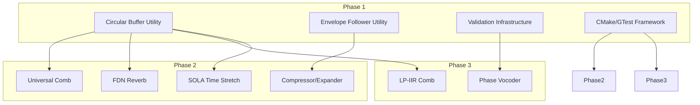

# Phase 1 Completion Gate: Implementation Plan

**Date:** 2026-01-11
**Version:** 3.0
**Status:** Complete
**Project:** DAFX_2_Daisy_lib

---

## 1. Introduction

This document defines the rigorous process and criteria for the **Phase 1 Completion Gate**. Satisfying these prerequisites is mandatory before initiating the parallel execution of Phase 2 (Enhancement) and Phase 3 (Advanced) activities. The goal is to ensure a stable, validated, and high-performance foundation.

### 1.1 Document Purpose
This plan serves as the authoritative quality gate mechanism, ensuring that the foundation established in Phase 1 is robust enough to support the increased complexity of spectral and advanced time-domain effects in subsequent phases.

---

## 2. Phase 1 Effects Reference

The following 10 effects constitute the Phase 1 scope. All must be implemented and verified.

| Effect Name | Category | Source Path | MATLAB Reference | Tolerance Tier |
|-------------|----------|-------------|------------------|----------------|
| **Tube Distortion** | Effects | `src/effects/tube.cpp` | `tube.m` | Standard (±0.5 dB) |
| **Low Shelving** | Filters | `src/filters/lowshelving.cpp` | `lowshelving.m` | Standard (±0.5 dB) |
| **High Shelving** | Filters | `src/filters/highshelving.cpp` | Derived from `lowshelving.m` | Standard (±0.5 dB) |
| **Peak Filter** | Filters | `src/filters/peakfilter.cpp` | `peakfilt.m` | Standard (±0.5 dB) |
| **Vibrato** | Modulation | `src/modulation/vibrato.cpp` | `vibrato.m` | Standard (±0.5 dB) |
| **Ring Modulator** | Modulation | `src/modulation/ringmod.cpp` | Custom | Standard (±0.5 dB) |
| **Stereo Panning** | Spatial | `src/spatial/stereopan.cpp` | `stereopan.m` | Standard (±0.5 dB) |
| **Noise Gate** | Dynamics | `src/dynamics/noisegate.cpp` | `noisegt.m` | Standard (±0.5 dB) |
| **CryBaby Wah** | Effects | `src/effects/wahwah.cpp` | DAFX Ch. 12 | Relaxed (±1.0 dB) |
| **Tone Stack** | Effects | `src/effects/tonestack.cpp` | DAFX Ch. 12 | Relaxed (±1.0 dB) |

---

## 3. Prerequisite Analysis & Categorization

### 3.1 Technical Prerequisites
| Requirement | Description | Acceptance Criteria |
|-------------|-------------|---------------------|
| **Algorithm Implementation** | All 10 Phase 1 effects implemented | 100% completion in `src/` |
| **Unit Test Suite** | Comprehensive tests for all effects | 100% pass rate; >80% coverage |
| **MATLAB Validation** | Accuracy verification against reference | Tier-based (±0.5 dB or ±1.0 dB) |
| **Performance Benchmarks** | CPU/RAM usage on Daisy Seed | Within per-effect budgets (See 3.4) |
| **Build Integrity** | Warning-free compilation | Zero warnings with ARM GCC 10.3+ |

### 3.2 Resource Prerequisites
| Requirement | Description | Status |
|-------------|-------------|--------|
| **Validation Infra** | Python engine for MATLAB comparison | ✅ Complete (`python_validation_infrastructure/`, v3.2.0) |
| **Test Framework** | GTest integration in CMake | ✅ Complete |
| **Hardware** | Daisy Seed for benchmarking | ✅ Available |

### 3.3 Documentation Prerequisites
| Requirement | Description | Status |
|-------------|-------------|--------|
| **Header Docs** | Doxygen-style comments in all files | ✅ Complete |
| **Performance Report** | `docs/performance_report.md` | ✅ Complete |
| **Usage Examples** | 3+ hardware-agnostic examples | ✅ Complete (3 examples) |
| **Checkpoint Status** | `CHECKPOINT.md` updated to v1.0 | ✅ Complete (v0.9) |
| **Core Utilities** | CircularBuffer, EnvelopeFollower | ✅ Complete |

### 3.4 Performance Budget Reference
| Category | CPU Target | RAM Target |
|----------|------------|------------|
| **Filters** | < 5% | < 100 bytes |
| **Modulation** | < 10% | < 50 KB |
| **Dynamics/Spatial** | < 10% | < 1 KB |
| **Virtual Analog** | < 15% | < 1 KB |

---

## 4. Interdependency Mapping

The following Phase 1 outputs are critical blockers for Phase 2/3:



---

## 5. Risk Assessment & Mitigation

| Risk | Impact | Mitigation Strategy |
|------|--------|---------------------|
| **Validation Discrepancy** | High | Use Tiered Tolerances (±1.0 dB for VA models); document deviations. |
| **CPU Overload** | Medium | Profile early on hardware; use ARM CMSIS-DSP optimizations if needed. |
| **Infra Delays** | High | Prioritize `python_validation_infrastructure/` core over CLI features. |
| **Unstable Foundation** | Critical | Strict "No-Go" if core utilities (Circular Buffer) fail any unit tests. |
| **Hardware Unavailability** | Medium | Use cycle-accurate simulator or defer benchmarking to Week 1 of P2. |

---

## 6. Implementation Plan for the Gate

### 6.1 Validation Checkpoints
- **Checkpoint 1 (T-Minus 3 Days)**: Unit Test Freeze. All tests must be written and passing.
- **Checkpoint 2 (T-Minus 1 Day)**: Validation & Performance Sweep. Final MATLAB and hardware runs.
- **Checkpoint 3 (Gate Day)**: Formal Review. Sign-off by stakeholders.

### 6.2 RACI Matrix
| Activity | Lead Architect | QA Lead | DSP Developer | Project Manager |
|----------|----------------|---------|---------------|-----------------|
| Code Review | **A/R** | I | C | I |
| Test Verification | I | **A/R** | C | I |
| MATLAB Validation | I | **A/R** | C | I |
| Performance Benchmarking | C | **A/R** | C | I |
| Gate Decision | **A** | R | I | C |

*R=Responsible, A=Accountable, C=Consulted, I=Informed*

### 6.3 Verification Methods
- **Automated**: `ctest` reports, `python_validation_infrastructure/` JSON output.
- **Manual**: Code review, hardware observation, documentation audit.

### 6.4 Escalation Procedures
- **Minor Failure** (e.g., 1 non-critical test failing): 24h fix window; conditional advancement.
- **Major Failure** (e.g., Validation > Tier Tolerance): Halt Phase 2/3; 48h resolution window.
- **Critical Failure** (e.g., Build broken, Utility failure): Immediate project-wide alert; no advancement.

---

## 7. Decision Framework for Advancement

| Scenario | Decision | Action |
|----------|----------|--------|
| **All Criteria Met** | **GREEN** | Full start of Phase 2/3 Parallel Execution. |
| **MVC Met, Minor Gaps** | **YELLOW** | Start P2/P3 on feature branches; no merge to `main` until gaps closed. |
| **MVC Not Met** | **RED** | Halt P2/P3; 100% focus on Phase 1 remediation. |

**Minimum Viable Criteria (MVC):**
- 10/10 effects implemented and compiling.
- 10/10 effects pass unit tests (Init, Param, Output, KIO).
- 9/10 effects pass MATLAB validation at their respective tiers.
- Core Utilities (Circular Buffer, Envelope Follower) verified 100%.
- Performance benchmarks for 10/10 effects documented.

---

## 8. Timeline & Milestones (Gate Week)

| Day | Milestone | Deliverable |
|-----|-----------|-------------|
| **Day 1** | Infra Ready | `python_validation_infrastructure/` functional |
| **Day 2** | Tests Ready | 100% Unit Test coverage for Phase 1 |
| **Day 3** | Validated | Full MATLAB validation suite results |
| **Day 4** | Benchmarked | Performance metrics documented for all 10 effects |
| **Day 5** | **GATE REVIEW** | Signed Gate Review Document |

---

## 9. Gate Review Checklist

- [ ] **Build**: `cmake .. && make` succeeds with zero warnings (ARM GCC 10.3+)?
- [ ] **Tests**: `ctest` shows 100% pass rate for all 10 effects?
- [ ] **Validation**: `validate_effect.py` shows tier-compliance for 9/10+ effects?
- [ ] **Performance**: All effects meet CPU and RAM budgets in Section 3.4?
- [ ] **Examples**: 3+ examples compile and function as expected?
- [ ] **Documentation**: All headers documented? `performance_report.md` complete?
- [ ] **Utilities**: Circular Buffer and Envelope Follower verified 100%?

---

## 10. Documentation Templates

### 10.1 Gate Review Sign-off Template
```markdown
# Phase 1 Gate Review Sign-off

**Date:** [YYYY-MM-DD]
**Reviewers:** [Names]

## Status Summary
- **Technical:** [Green/Yellow/Red]
- **Documentation:** [Green/Yellow/Red]
- **Performance:** [Green/Yellow/Red]

## Decision
[ ] Approved for Phase 2/3 Parallel Execution
[ ] Conditionally Approved (See Remediation Plan)
[ ] Rejected (See Blockers)

## Remediation Plan (if applicable)
1. [Task] - [Owner] - [Due Date]

## Signatures
Lead Architect: ____________________
QA Lead: __________________________
```

---

## 11. Changelog

| Version | Date | Author | Description |
|---------|------|--------|-------------|
| 1.0 | 2026-01-11 | Initial | Initial draft. |
| 2.0 | 2026-01-11 | Kilo Code | Comprehensive enhancement: added effects table, tiered tolerances, RACI matrix, Mermaid diagrams, and strengthened MVC. |
