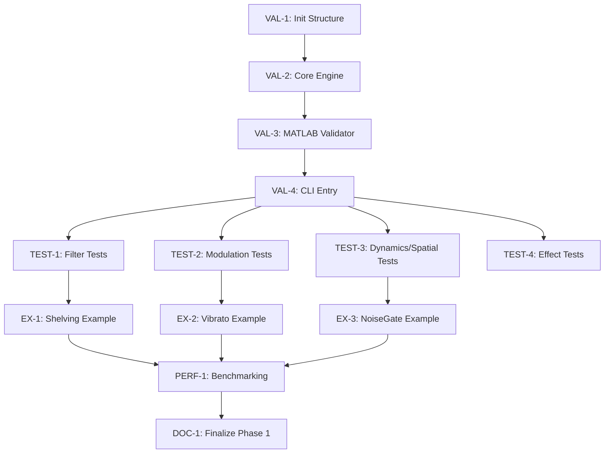

# Phase 1: Remaining Tasks Execution Plan

**Date:** 2026-01-10
**Version:** 1.0
**Status:** Active
**Project:** DAFX_2_Daisy_lib

---

## 1. Executive Summary

This plan outlines the final steps required to complete **Phase 1: Foundation** of the DAFX_2_Daisy_lib project. While the 10 core DSP algorithms are implemented, they require comprehensive unit testing, MATLAB validation, performance benchmarking, and example programs to meet the Phase 1 completion criteria.

---

## 2. Current Status (Cross-Referenced)

| Component | Action Plan Status | CHECKPOINT.md Status | Actual State |
|-----------|--------------------|----------------------|--------------|
| **Infrastructure** | ⚠️ Partial | ✅ Complete | Directory structure, CMake, and GTest framework are ready. |
| **Algorithm Implementation** | ⚠️ Partial | ✅ Complete | 10/10 effects implemented in `src/`. |
| **Unit Tests** | ❌ Missing | ✅ Complete (Framework) | Only `test_tube.cpp` exists. 9/10 effects lack tests. |
| **Validation Scripts** | ❌ Missing | ❌ Not Started | `execution/` directory is empty. |
| **Examples** | ❌ Missing | ⚠️ Partial | `examples/CMakeLists.txt` exists, but no `.cpp` files. |
| **Documentation** | ⚠️ Partial | 🔄 In Progress | Headers are documented, but `CHECKPOINT.md` needs update. |

---

## 3. Detailed Implementation Roadmap

### 3.1 Python Validation Infrastructure (Priority: CRITICAL)
**Goal:** Establish the automated validation system to compare C++ outputs with MATLAB references.

| Task ID | Task Description | File Paths | Acceptance Criteria |
|---------|------------------|------------|---------------------|
| **VAL-1** | Initialize `execution/` structure | `execution/core/`, `execution/modules/` | All directories and `__init__.py` files created. |
| **VAL-2** | Implement Core Engine & Logging | `execution/core/engine.py`, `logger.py` | Structured logging to console and JSON file. |
| **VAL-3** | Create MATLAB Comparison Module | `execution/modules/dsp/validator.py` | Can load `.m` data and compare with C++ output within ±0.5 dB. |
| **VAL-4** | Create CLI Entry Point | `execution/validate_effect.py` | CLI supports `--effect [name]` and `--all` flags. |

**Dependencies:** None.

---

### 3.2 Unit Test Suite Expansion (Priority: HIGH)
**Goal:** Achieve 100% test coverage for all Phase 1 effects using the established patterns.

| Task ID | Task Description | File Paths | Acceptance Criteria |
|---------|------------------|------------|---------------------|
| **TEST-1** | Create Filter Tests | `tests/test_lowshelving.cpp`, `test_highshelving.cpp`, `test_peakfilter.cpp` | All tests pass; follows `TEST_PATTERNS.md`. |
| **TEST-2** | Create Modulation Tests | `tests/test_vibrato.cpp`, `test_ringmod.cpp` | All tests pass; follows `TEST_PATTERNS.md`. |
| **TEST-3** | Create Dynamics/Spatial Tests | `tests/test_noisegate.cpp`, `test_stereopan.cpp` | All tests pass; follows `TEST_PATTERNS.md`. |
| **TEST-4** | Create Effect Tests | `tests/test_wahwah.cpp`, `test_tonestack.cpp` | All tests pass; follows `TEST_PATTERNS.md`. |

**Dependencies:** VAL-4 (for automated validation integration).

---

### 3.3 Hardware-Agnostic Examples (Priority: MEDIUM)
**Goal:** Provide clear usage examples for developers.

| Task ID | Task Description | File Paths | Acceptance Criteria |
|---------|------------------|------------|---------------------|
| **EX-1** | Shelving Filter Example | `examples/example_shelving.cpp` | Demonstrates Low/High shelving; compiles. |
| **EX-2** | Vibrato Modulation Example | `examples/example_vibrato.cpp` | Demonstrates Vibrato usage; compiles. |
| **EX-3** | Noise Gate Dynamics Example | `examples/example_noisegate.cpp` | Demonstrates NoiseGate usage; compiles. |

**Dependencies:** TEST-1, TEST-2, TEST-3.

---

### 3.4 Performance & Documentation (Priority: MEDIUM)
**Goal:** Verify real-time suitability and finalize Phase 1 records.

| Task ID | Task Description | File Paths | Acceptance Criteria |
|---------|------------------|------------|---------------------|
| **PERF-1** | CPU/RAM Benchmarking | `docs/performance_report.md` | Metrics for all 10 effects documented. |
| **DOC-1** | Finalize Phase 1 Docs | `CHECKPOINT.md`, `README.md` | All Phase 1 items marked [x] and instructions updated. |

**Dependencies:** EX-1, EX-2, EX-3.

---

## 4. Task Dependencies & Workflow

---

## 5. Acceptance Criteria for Phase 1 Completion

1.  **100% Pass Rate:** All 10 effects pass unit tests in `tests/`.
2.  **MATLAB Validated:** All 10 effects validated against MATLAB references within ±0.5 dB.
3.  **Zero Warnings:** Library and examples compile with zero warnings using ARM GCC.
4.  **Performance Met:** All effects stay within the defined CPU/RAM budget (documented in `performance_report.md`).
5.  **Examples Ready:** 3+ hardware-agnostic examples are functional and documented.
6.  **Checkpoint Updated:** `CHECKPOINT.md` reflects v1.0-phase1-complete.

---

## 6. Estimated Effort (Relative)

- **Python Infrastructure:** High (New system)
- **Unit Testing:** Medium (Repetitive but critical)
- **Examples:** Low (Straightforward implementation)
- **Validation/Benchmarking:** Medium (Requires careful measurement)
