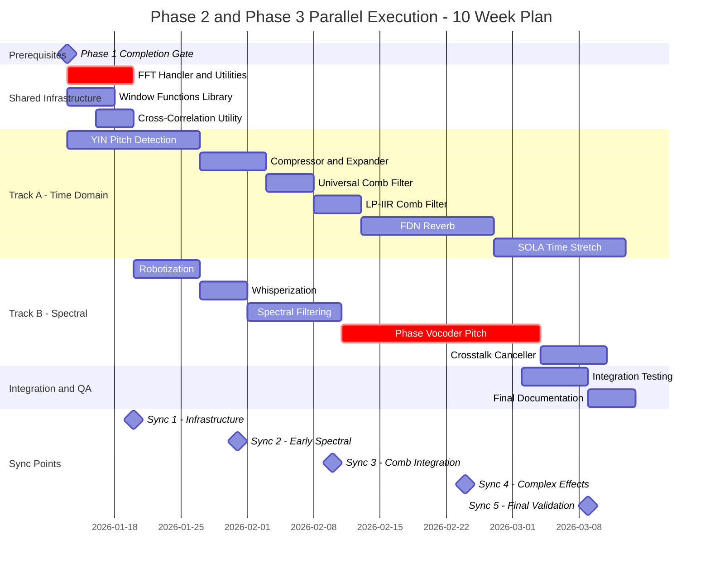

# Phase 2 & Phase 3 Parallel Execution Plan

**Date:** 2026-01-12
**Version:** 3.0 (Final - All Complete)
**Status:** ✅ Complete - All Tracks Finished
**Project:** DAFX_2_Daisy_lib

---

## 1. Executive Summary

This document defines the comprehensive strategy for the **simultaneous execution of Phase 2 (Enhancement)** and **Phase 3 (Advanced)** of the DAFX-to-DaisySP library project. The plan implements 11 DSP algorithms across two parallel development tracks while leveraging shared infrastructure components.

### Key Revisions in v2.0
- **Corrected timeline**: Extended from 8 weeks to **10 weeks** based on realistic task duration analysis
- **Added Phase 1 completion gate**: Prerequisite validation before parallel execution begins
- **Expanded shared infrastructure**: Added `princarg()`, window functions, and cross-correlation utilities
- **Resequenced YIN Pitch Detection**: Moved to Week 1-2 (no FFT dependency) to reduce critical path
- **Added intermediate synchronization points**: Weekly checkpoints with defined pass criteria
- **Enhanced risk assessment**: Includes Phase 1 dependency and integration failure risks
- **Added latency budget section**: Documents acceptable latency per effect category

---

## 2. Prerequisites: Phase 1 Completion Gate

✅ **GATE PASSED** (2026-01-11): All Phase 1 requirements verified complete.

| Phase 1 Requirement | Status | Evidence |
|---------------------|--------|----------|
| All 10 effects implemented | ✅ Complete | `src/effects/`, `src/filters/`, `src/modulation/`, `src/dynamics/`, `src/spatial/` |
| Unit tests for all 10 effects | ✅ Complete | `tests/test_*.cpp` (12 total: 10 effects + 2 utilities) |
| MATLAB validation infrastructure | ✅ Complete | `python_validation_infrastructure/` v3.2.0, `validate_effect.py` |
| Performance benchmarks documented | ✅ Complete | `docs/performance_report.md` |
| CMake builds without warnings | ✅ Complete | `CMakeLists.txt` with GTest FetchContent |
| Core utilities implemented | ✅ Complete | `src/utility/circularbuffer.h`, `src/utility/envelopefollower.h` |
| Usage examples | ✅ Complete | 3 examples in `examples/` |
| Gate Review Sign-off | ✅ Complete | `docs/Phase1_Gate_Review_Signoff.md` |

**Gate Decision: 🟢 GREEN** - Approved for Phase 2/3 Parallel Execution

See: [Phase1_Gate_Review_Signoff.md](../docs/Phase1_Gate_Review_Signoff.md)

---

## 3. Parallel Execution Strategy: Dual-Track Model

The 11 effects are organized into two tracks based on **DSP primitive dependencies**, not phase membership. This enables efficient parallel development.

### Track A: Time-Domain & Dynamics
*Primary dependency: Delay lines, envelope followers*

| # | Effect | Phase | Complexity | Status | File |
|---|--------|-------|------------|--------|------|
| 1 | YIN Pitch Detection | 2 | High | ✅ Complete | `src/analysis/yin.h` |
| 2 | Compressor/Expander | 2 | Medium | ✅ Complete | `src/dynamics/compressor_expander.h` |
| 3 | Universal Comb Filter | 2 | Low | ✅ Complete | `src/effects/universal_comb.h` |
| 4 | LP-IIR Comb Filter | 3 | Medium | ✅ Complete | `src/effects/lp_iir_comb.h` |
| 5 | FDN Reverb | 2 | High | ✅ Complete | `src/effects/fdn_reverb.h` |
| 6 | SOLA Time Stretch | 2 | High | ✅ Complete | `src/effects/sola_time_stretch.h` |

### Track B: Spectral & Advanced Filtering
*Primary dependency: FFT infrastructure, phase processing*

| # | Effect | Phase | Complexity | Status | File |
|---|--------|-------|------------|--------|------|
| 1 | Robotization | 2 | Medium | ✅ Complete | `src/spectral/robotization.h` |
| 2 | Whisperization | 2 | Medium | ✅ Complete | `src/spectral/whisperization.h` |
| 3 | Spectral Filtering | 3 | High | ✅ Complete | `src/spectral/spectral_filter.h` |
| 4 | Phase Vocoder Pitch | 3 | Very High | ✅ Complete | `src/spectral/phase_vocoder.h` |
| 5 | Crosstalk Canceller | 3 | Medium | ✅ Complete | `src/spatial/crosstalk_canceller.h` |

---

## 4. Shared Infrastructure Requirements

### 4.1 Week 1 Foundation Deliverables

All shared utilities must be implemented and tested before track-specific development begins.

| Component | Location | Used By | Status |
|-----------|----------|---------|--------|
| **FFT Handler** | `src/utility/fft_handler.h` | Robotization, Whisperization, Spectral Filtering, Phase Vocoder, Crosstalk Canceller | ✅ Complete |
| **Circular Buffer** | `src/utility/circularbuffer.h` | Universal Comb, LP-IIR Comb, FDN Reverb, SOLA, Vibrato (Phase 1) | ✅ Complete |
| **Phase Unwrap** | `src/utility/princarg.h` | Phase Vocoder, Spectral effects | ✅ Complete |
| **Window Functions** | `src/utility/windows.h` | All spectral effects, SOLA | ✅ Complete |
| **Cross-Correlation** | `src/utility/xcorr.h` | SOLA Time Stretch | ✅ Complete |
| **Envelope Follower** | `src/utility/envelopefollower.h` | Compressor/Expander, Noise Gate (Phase 1) | ✅ Complete |

### 4.2 FFT Configuration Matrix

| Effect | FFT Size | Hop Size | Latency @ 48kHz |
|--------|----------|----------|-----------------|
| Robotization | 1024 | 441 | 21.3 ms |
| Whisperization | 512 | 64 | 10.7 ms |
| Spectral Filtering | 2560 | 1280 | 26.7 ms |
| Phase Vocoder | 2048 | 512 | 42.7 ms |

---

## 5. Detailed Task Breakdown

### 5.1 Phase 2 Effects (Enhancement)

#### YIN Pitch Detection
- **Complexity**: High
- **Key Challenge**: O(N × τ_max) autocorrelation computation; real-time optimization required
- **MATLAB**: [`yinDAFX.m`](../DAFX-MATLAB/M_files_chap09/yinDAFX.m:1)
- **Memory**: ~16 KB (yinLen=1024, taumax~1000 samples)
- **CPU Target**: <15%
- **Dependencies**: None (time-domain only - can start immediately)

#### Robotization
- **Complexity**: Medium
- **Key Challenge**: FFT/IFFT with magnitude-only reconstruction
- **MATLAB**: [`VX_robot.m`](../DAFX-MATLAB/M_files_chap07/VX_robot.m:1)
- **Memory**: ~8 KB (1024-pt FFT buffers)
- **CPU Target**: <10%
- **Dependencies**: FFT Handler, Hanning Window

#### Whisperization
- **Complexity**: Medium
- **Key Challenge**: Random phase generation performance
- **MATLAB**: [`VX_whisper.m`](../DAFX-MATLAB/M_files_chap07/VX_whisper.m:1)
- **Memory**: ~4 KB (512-pt FFT buffers)
- **CPU Target**: <10%
- **Dependencies**: FFT Handler, Random Number Generator

#### SOLA Time Stretch
- **Complexity**: High
- **Key Challenge**: Cross-correlation alignment for seamless overlap-add
- **MATLAB**: [`TimeScaleSOLA.m`](../DAFX-MATLAB/M_files_chap06/TimeScaleSOLA.m:1)
- **Memory**: 32-64 KB SDRAM (N=2048, correlation buffer)
- **CPU Target**: <20%
- **Dependencies**: Cross-Correlation utility, Window Functions

#### FDN Reverb
- **Complexity**: High
- **Key Challenge**: 4×4 feedback matrix efficiency; prime delay lengths
- **MATLAB**: [`delaynetwork.m`](../DAFX-MATLAB/M_files_chap05/delaynetwork.m:1)
- **Memory**: ~2-4 MB SDRAM (4 delay lines)
- **CPU Target**: <15%
- **Dependencies**: Circular Buffer, LP-IIR Comb (optional damping)

#### Compressor/Expander
- **Complexity**: Medium
- **Key Challenge**: Logarithmic gain calculation; attack/release curves
- **MATLAB**: [`compexp.m`](../DAFX-MATLAB/M_files_chap04/compexp.m:1)
- **Memory**: ~2 KB (delay buffer 150 samples)
- **CPU Target**: <5%
- **Dependencies**: Envelope Follower

#### Universal Comb Filter
- **Complexity**: Low
- **Key Challenge**: Configurable feedforward/feedback topology
- **MATLAB**: [`unicomb.m`](../DAFX-MATLAB/M_files_chap02/unicomb.m:1)
- **Memory**: <1 KB
- **CPU Target**: <2%
- **Dependencies**: Circular Buffer

### 5.2 Phase 3 Effects (Advanced)

#### Phase Vocoder Pitch Shifting
- **Complexity**: Very High
- **Key Challenge**: Phase unwrapping, accumulation, and grain interpolation
- **MATLAB**: [`VX_pitch_pv.m`](../DAFX-MATLAB/M_files_chap07/VX_pitch_pv.m:1)
- **Memory**: ~32 KB (2048-pt FFT, phase buffers)
- **CPU Target**: <25%
- **Dependencies**: FFT Handler, princarg(), Window Functions

#### LP-IIR Comb Filter
- **Complexity**: Medium
- **Key Challenge**: First-order LP filter in feedback loop stability
- **MATLAB**: [`lpiircomb.m`](../DAFX-MATLAB/M_files_chap02/lpiircomb.m:1)
- **Memory**: <2 KB
- **CPU Target**: <3%
- **Dependencies**: Circular Buffer

#### Spectral Filtering
- **Complexity**: High
- **Key Challenge**: Frequency-domain convolution with FIR response
- **MATLAB**: [`VX_filter.m`](../DAFX-MATLAB/M_files_chap07/VX_filter.m:1)
- **Memory**: ~16 KB (1280-pt FIR, 2560-pt FFT)
- **CPU Target**: <15%
- **Dependencies**: FFT Handler

#### Crosstalk Canceller
- **Complexity**: Medium
- **Key Challenge**: HRIR-based matrix inversion; regularization
- **MATLAB**: [`crosstalkcanceler.m`](../DAFX-MATLAB/M_files_chap05/crosstalkcanceler.m:1)
- **Memory**: ~8 KB (HRIR filters)
- **CPU Target**: <10%
- **Dependencies**: FFT Handler (for frequency-domain inversion), simpleHRIR module

---

## 6. Resource Allocation & Team Structure

### 6.1 Team Roles

| Role | Count | Responsibilities |
|------|-------|------------------|
| **Lead Architect** | 1 | Shared infrastructure, cross-track integration, code review |
| **DSP Developer A** | 1 | Track A effects (Time-Domain/Dynamics) |
| **DSP Developer B** | 1 | Track B effects (Spectral/FFT-based) |
| **QA/Validation** | 1 | Test automation, MATLAB validation, benchmarking |

### 6.2 Weekly Allocation Matrix

| Week | Lead Architect | Dev A | Dev B | QA |
|------|---------------|-------|-------|-----|
| 0 | Phase 1 gate review | Phase 1 tests | Phase 1 tests | Validation baseline |
| 1 | Infrastructure | YIN (start) | Infrastructure support | Test harness |
| 2 | Integration support | YIN + Comp/Exp | Robot + Whisper | Early validation |
| 3 | Code review | Uni/LP Comb | Rob/Whisp complete | Spectral validation |
| 4 | Reverb support | FDN Reverb | Spectral Filter | FDN benchmarking |
| 5 | Integration | FDN cont. | Spectral cont. | Integration tests |
| 6 | Phase Vocoder support | SOLA | Phase Vocoder | PV validation |
| 7 | Integration | SOLA cont. | PV cont. | Performance sweep |
| 8 | Crosstalk support | SOLA complete | Crosstalk | Final benchmarks |
| 9 | Final integration | Bug fixes | Bug fixes | Regression suite |
| 10 | Documentation | Documentation | Documentation | Report generation |

---

## 7. Critical Path & Sequencing

### 7.1 Revised Timeline (10 Weeks)

```
Week 0:  Phase 1 Completion Gate
Week 1:  Infrastructure + YIN Start
Week 2:  YIN + Compressor + Robotization + Whisperization
Week 3:  Comb Filters + Spectral Effects
Week 4:  FDN Reverb + Spectral Filtering
Week 5:  FDN + Spectral cont. + Integration
Week 6:  SOLA + Phase Vocoder Start
Week 7:  SOLA cont. + Phase Vocoder
Week 8:  SOLA Complete + Phase Vocoder + Crosstalk
Week 9:  Bug Fixes + Integration Testing
Week 10: Documentation + Final QA
```

### 7.2 Critical Path Analysis

The critical path runs through **Track B** due to Phase Vocoder complexity:

```
Infrastructure (7d) → Robotization (5d) → Whisperization (5d) → 
Spectral Filtering (10d) → Phase Vocoder (21d) → Crosstalk (7d) → QA (7d)
= 62 days minimum
```

**Optimization Applied**: YIN Pitch Detection (no FFT dependency) starts in parallel with infrastructure, saving 10 days on Track A.

### 7.3 Revised Gantt Chart



---

## 8. Synchronization Checkpoints

### 8.1 Checkpoint Schedule

| Sync Point | Week | Focus Area | Tracks Involved |
|------------|------|------------|-----------------|
| **S1** | End of Week 1 | Infrastructure Review | Both |
| **S2** | End of Week 2 | Early Spectral Validation | Track B |
| **S3** | End of Week 3 | Comb Filter Integration | Track A |
| **S4** | Mid Week 6 | Complex Effects Mid-Review | Both |
| **S5** | End of Week 9 | Final Validation | Both |

### 8.2 Checkpoint Pass Criteria

Each synchronization checkpoint requires ALL of the following:

| Criterion | Measurement | Threshold |
|-----------|-------------|-----------|
| Unit Tests | Pass rate | 100% |
| MATLAB Validation | Maximum deviation | ±0.5 dB |
| CPU Usage | Measured on Daisy Seed | Per-effect budget |
| Memory Usage | Static analysis + runtime | Per-effect budget |
| Code Review | Lead Architect approval | Approved |
| Documentation | Header comments complete | 100% |

### 8.3 Checkpoint Failure Protocol

1. **Immediate**: Notify Lead Architect and QA
2. **Within 24h**: Root cause analysis documented
3. **Within 48h**: Corrective action plan approved
4. **Escalation**: If failure persists >72h, invoke Schedule Slip contingency

---

## 9. Memory & Performance Budgets

### 9.1 Per-Effect Budgets

| Effect | CPU Target | RAM (Internal) | RAM (SDRAM) | Latency |
|--------|------------|----------------|-------------|---------|
| YIN Pitch | <15% | 16 KB | - | 21 ms |
| Robotization | <10% | 8 KB | - | 21 ms |
| Whisperization | <10% | 4 KB | - | 11 ms |
| SOLA | <20% | 8 KB | 64 KB | Variable |
| FDN Reverb | <15% | 2 KB | 4 MB | ~6 ms |
| Compressor | <5% | 2 KB | - | 3 ms |
| Uni Comb | <2% | 1 KB | - | <1 ms |
| LP-IIR Comb | <3% | 2 KB | - | <1 ms |
| Phase Vocoder | <25% | 32 KB | - | 43 ms |
| Spectral Filter | <15% | 16 KB | - | 27 ms |
| Crosstalk | <10% | 8 KB | - | Variable |

### 9.2 Aggregate Budget Constraints

| Scenario | Max Effects | Total CPU | Total RAM |
|----------|-------------|-----------|-----------|
| Single FFT effect | 1 | 25% | 32 KB |
| Two spectral + dynamics | 3 | 50% | 64 KB |
| Full creative chain | 5-6 | 70% | 128 KB + SDRAM |

### 9.3 Latency Acceptability Matrix

| Use Case | Max Acceptable Latency | Compatible Effects |
|----------|------------------------|-------------------|
| Live performance | <10 ms | Comb filters, Compressor, Whisperization |
| Studio monitoring | <25 ms | + Robotization, YIN, Spectral Filter |
| Offline processing | Unlimited | All effects |

---

## 10. Risk Assessment & Mitigation

### 10.1 Risk Matrix

| Risk | Probability | Impact | Mitigation |
|------|-------------|--------|------------|
| **Phase 1 Tests Incomplete** | HIGH | CRITICAL | Week 0 gate - block start until resolved |
| **FFT CPU Overload** | MEDIUM | HIGH | Use ARM CMSIS-DSP optimized routines |
| **SDRAM Allocation Conflicts** | MEDIUM | HIGH | Define memory map; FDN and SOLA in separate regions |
| **Phase Discontinuity** | MEDIUM | MEDIUM | Implement phase-locking in Phase Vocoder |
| **Integration Failures** | MEDIUM | MEDIUM | Bi-weekly integration checkpoints |
| **MATLAB Reference Inaccuracy** | LOW | MEDIUM | Cross-validate with alternative resources |
| **Hardware Unavailability** | LOW | MEDIUM | Identify backup Daisy Seed units |
| **Scope Creep - simpleHRIR** | MEDIUM | LOW | Implement minimal HRIR stub; defer full implementation |
| **Timeline Slip** | MEDIUM | MEDIUM | 2-week buffer built into schedule |

### 10.2 Contingency Plans

| Trigger | Action |
|---------|--------|
| Phase 1 gate fails | Pause Phase 2/3; redirect all resources to Phase 1 completion |
| FFT exceeds 30% CPU | Switch to radix-4 or table-based implementation |
| Effect exceeds memory budget | Profile and optimize; consider reduced FFT size |
| Sync checkpoint fails | 72h resolution window; escalate to scope reduction if unresolved |
| Timeline slip >1 week | Defer Phase 3 effects; prioritize Phase 2 completion |

---

## 11. Testing & Validation Strategy

### 11.1 Test Categories

| Category | Frequency | Automation |
|----------|-----------|------------|
| **Unit Tests** | Per-commit | GTest (CI/CD) |
| **MATLAB Validation** | Per-effect completion | Python scripts |
| **Integration Tests** | Weekly | Manual + automated |
| **Performance Benchmarks** | Per-checkpoint | Daisy Seed measurement |
| **Stress Tests** | End of phase | Full chain on hardware |

### 11.2 Validation Pipeline

```
1. Developer implements effect
2. Unit tests written (follows TEST_PATTERNS.md)
3. Local build passes
4. MATLAB validation script executed
5. If ±0.5 dB: proceed to code review
6. If fails: iterate on implementation
7. Code review by Lead Architect
8. Merge to main branch
9. CI/CD runs full test suite
10. Benchmark on Daisy Seed hardware
```

### 11.3 Test Coverage Requirements

| Phase | Unit Test Coverage | MATLAB Validation |
|-------|-------------------|-------------------|
| Phase 2 | >90% | 100% of effects |
| Phase 3 | >85% | 100% of effects |

---

## 12. Milestones & Acceptance Criteria

### Milestone M1: Infrastructure Complete (End of Week 1)
- [ ] FFT Handler tested with 512, 1024, 2048 point transforms
- [ ] Circular buffer supports variable delay up to 64K samples
- [ ] princarg() validated against MATLAB implementation
- [ ] Window functions: Hanning, Blackman-Harris, Triangular
- [ ] Cross-correlation utility functional

### Milestone M2: Early Effects Complete (End of Week 3)
- [ ] YIN Pitch Detection: <15% CPU, ±5 cents accuracy
- [ ] Compressor/Expander: Accurate gain curves
- [ ] Robotization: Clean metallic effect
- [ ] Whisperization: No tonal artifacts

### Milestone M3: Filtering Complete (End of Week 5)
- [ ] Universal Comb: Stable at all feedback values
- [ ] LP-IIR Comb: Smooth high-frequency damping
- [ ] Spectral Filtering: Clean bandpass response

### Milestone M4: Complex Effects Complete (End of Week 8)
- [ ] FDN Reverb: Lush, non-metallic tail
- [ ] SOLA Time Stretch: Seamless crossfades at 0.5x-2x
- [ ] Phase Vocoder: Clean pitch shifting ±1 octave
- [ ] Crosstalk Canceller: Improved stereo separation

### Milestone M5: Phase 2/3 Complete (End of Week 10)
- [ ] All 11 effects pass unit tests (100%)
- [ ] All effects validated against MATLAB (±0.5 dB)
- [ ] Performance report generated
- [ ] Documentation complete
- [ ] CHECKPOINT.md updated to v1.0-phase23-complete

---

## 13. Communication Protocols

### 13.1 Regular Meetings

| Meeting | Frequency | Participants | Purpose |
|---------|-----------|--------------|---------|
| Daily Standup | Daily | All | Progress, blockers |
| Track Sync | 2x/week | Lead + Track Devs | Cross-track coordination |
| QA Review | Weekly | Lead + QA | Validation status |
| Checkpoint Review | Per sync point | All | Formal gate review |

### 13.2 Communication Channels

| Channel | Use Case |
|---------|----------|
| GitHub Issues | Bug tracking, feature requests |
| Pull Requests | Code review, integration |
| CHECKPOINT.md | Project status documentation |
| dafx_bugs.md | Known issues and workarounds |

### 13.3 Escalation Path

```
Developer → Lead Architect → [Technical Decision]
QA → Lead Architect → [Quality Gate Decision]
Any → Project Stakeholder → [Scope/Schedule Decision]
```

---

## 14. Budget Considerations

| Item | Cost | Notes |
|------|------|-------|
| Development Hardware | $60 | 2× Daisy Seed |
| Software | $0 | Open source toolchain |
| Compute Resources | $0 | Local development |
| MATLAB License | $0 | Use Octave for validation if needed |
| **Total** | **$60** | Hardware only |

---

## 15. Appendices

### Appendix A: MATLAB-to-C++ Translation Checklist

- [ ] Convert 1-indexed arrays to 0-indexed
- [ ] Replace matrix operations with explicit loops
- [ ] Use `fabsf()` instead of `abs()` for floats
- [ ] Replace `exp()` with `expf()` for single precision
- [ ] Implement circular buffer for MATLAB's automatic array extension

### Appendix B: File Naming Conventions

```
src/analysis/yin.cpp, yin.h         # YIN Pitch Detection
src/spectral/robotization.cpp       # Robotization
src/spectral/whisperization.cpp     # Whisperization
src/spectral/spectral_filter.cpp    # Spectral Filtering
src/spectral/phase_vocoder.cpp      # Phase Vocoder
src/dynamics/compressor.cpp         # Compressor/Expander
src/filters/comb_universal.cpp      # Universal Comb
src/filters/comb_lpiir.cpp          # LP-IIR Comb
src/spatial/fdn_reverb.cpp          # FDN Reverb
src/spatial/crosstalk_cancel.cpp    # Crosstalk Canceller
src/timedomain/sola.cpp             # SOLA Time Stretch
src/utility/fft_handler.cpp         # FFT Infrastructure
src/utility/windows.cpp             # Window Functions
src/utility/princarg.cpp            # Phase Unwrapping
src/utility/xcorr.cpp               # Cross-Correlation
```

### Appendix C: Quick Reference Commands

```bash
# Build library
mkdir build && cd build
cmake .. && make

# Run all tests
./tests/run_tests

# Validate single effect against MATLAB
python execution/validate_effect.py --effect robotization --tolerance 0.5

# Validate all Phase 2/3 effects
python execution/validate_effect.py --phase 2 --phase 3 --tolerance 0.5

# Benchmark on Daisy Seed
make benchmark && daisy_tool upload build/benchmark.bin
```

---

*Document Version: 2.0 | Last Updated: 2026-01-10 | Next Review: After M1 Checkpoint*
